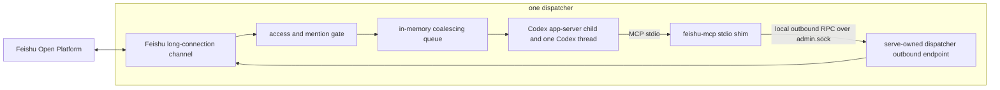

# Top-level design

- **Status:** Accepted
- **Date:** 2026-06-03
- **Affects:** server runtime, dispatcher lifecycle, Feishu channel, Codex MCP, admin/outbound IPC, global config, state files, logs, CLI admin surface, workspace-local bundled skill ownership
- **PR / Issue:** Local architecture clarification on 2026-06-03; supersedes the persistence and automatic-outbound parts of issue #2, the runtime-dir parts of `global-config-dir`, and loopback HTTP MCP as the default Feishu MCP transport

## Context

The MVP goal is to make `dreamux` run as a local dispatcher host:

- Feishu inbound messages reach one dispatcher.
- The dispatcher injects accepted messages into one Codex thread.
- Codex can reply to Feishu only by explicitly calling a dispatcher-scoped
  Feishu MCP tool.
- Local operator credentials live in `~/.dreamux/config.json`.

The current source tree accumulated runtime concepts before the MVP worked:
SQLite state, `runtime_dir`, automatic outbound forwarding of model text, and a
loopback HTTP MCP listener. Those pieces hide the product boundary and create
wrong security defaults.

This decision locks the MVP boundary.

## Architecture

`dreamux serve` is one local Node server. It hosts multiple dispatchers in the
same process. Each dispatcher owns exactly one Feishu channel, one Codex
app-server child process, one Codex thread, and one dispatcher-scoped Feishu MCP
stdio session.



Two dispatchers must never share a Feishu app identity, channel instance, MCP
stdio process, Codex app-server child process, Codex thread, or dispatcher state
file.

## Trust Domain

One dispatcher is one shared-context trust domain.

All gate-passing inbound messages for a dispatcher enter the same Codex thread.
If one dispatcher accepts messages from multiple chats, later turns can see
earlier content from the other chats in that dispatcher. This is intentional for
the MVP and is not per-chat isolation.

Operators must use separate dispatchers, with separate Feishu app identities,
when chats should not share context. Future chat-to-session routing is out of
scope for this decision.

The access gate and `doctor` or `status` surfaces must warn when one dispatcher
is configured for, or has observed, more than one allowed chat. The warning must
state that the dispatcher shares one Codex context across those chats.

## Operator Config

`~/.dreamux/config.json` is the only dreamux operator-editable config source.
It holds dispatcher declarations, local Feishu credentials, and the dispatcher
cwd used for the workspace-local skill install.

Example shape:

```json
{
  "dispatchers": [
    {
      "id": "dispatcher-a",
      "cwd": "/path/to/workspace",
      "enabled": true,
      "feishu": {
        "app_id": "APP_ID",
        "app_secret": "APP_SECRET"
      },
      "codex": {
        "extra_args": [],
        "extra_env": {
          "EXAMPLE_FLAG": "1"
        }
      }
    }
  ]
}
```

`feishu.app_id` is a unique dispatcher identity. Across all declared
dispatchers, including disabled dispatchers, an app id must map to exactly one
dispatcher. `dreamux serve`, `doctor`, and `onboard` must fail or report a
blocking error when two dispatchers use the same app id.

Rules:

- Feishu credentials belong only in `~/.dreamux/config.json` for MVP.
- The config file is owner-only (`0600`) because it may contain local Feishu
  secrets.
- Access-gate allowlists are not part of `config.json`. They live in the
  per-dispatcher `access.json` file described below.
- The long-connection MVP uses `app_id` and `app_secret`. Webhook-only
  verification/encryption fields are not part of the MVP schema. If a future
  webhook fallback adds them, they must be treated as secrets:
  owner-only config, redacted from `config show`, `status`, `doctor`, and logs,
  and never passed to Codex or MCP shim processes.
- `app_secret` must be redacted from `config show`, `status`, `doctor`, and
  logs.
- `codex.extra_env` is merged over the server process environment before
  starting that dispatcher's Codex app-server.
- `codex.extra_args` is passed to `codex app-server`.
- dreamux-generated MCP config overrides are injected last, so the dispatcher
  always receives the Feishu MCP server for its own channel.
- dreamux follows Codex's own `~/.codex/` home for Codex auth, config, and
  memory. dreamux must not create dispatcher-private `CODEX_HOME` directories
  for the MVP.
- dreamux does not pin, bundle, or manage the operator's Codex CLI version.
  Codex compatibility is enforced by `doctor`, live tests, and version
  diagnostics.

## State And Logs

State and logs are server-owned. They are not operator-editable config.

```text
~/.dreamux/
  config.json
  state/
    server.json
    admin.sock
    dispatcher-a/
      status.json
      access.json
      chat-bots.json
      codex.sock
  logs/
    dreamux-server.log
    daemon.stdout.log          when run as a daemon (onboard service redirect)
    daemon.stderr.log
    feishu-channel/
      dispatcher-a.log
    feishu-mcp/
      dispatcher-a.log         feishu-mcp stdio shim diagnostics (issue #70)
    codex-app-server/
      dispatcher-a.log         Codex app-server child stdout
      dispatcher-a.stderr.log  Codex app-server child stderr
```

Host logging (issue #70): `dreamux serve`, the Feishu channel (gate
deliver/drop, inbound submit, outbound, `/introduce`), and dispatcher lifecycle
write structured `pino` JSON to these files (and mirror to stderr so a
foreground `serve` stays visible). Path builders live in `src/runtime/paths.ts`;
logger construction lives in `src/runtime/logger.ts`. Message bodies are never
logged; `app_secret` is redacted. See
[the logging decision](logging.md).

`server.json` stores process-level status only: pid, status, version, started
time, admin socket path, and last error.

`status.json` stores dispatcher process status, last-known Codex thread id,
child process status, and diagnostic timestamps. It must not contain Feishu
credentials. It is server-owned, rebuildable recovery state: on an
incompatible/unknown version, malformed JSON, or a dispatcher-id mismatch,
`hydrate()` warns and rebuilds the row from config defaults (a saved thread_id
may not be resumed) — it never silently discards and never hard-fatals the
server (issue #98). Likewise the one-shot `restart-intent.json` marker: a
malformed or unknown-version marker is warned and dropped, not silently ignored.

`access.json` stores dispatcher-local access state. The shape is:

```json
{
  "version": 2,
  "allow_users": ["USER_ID"],
  "group": {
    "policy": "follow-user",
    "allow_chats": ["CHAT_ID"],
    "require_mention": true
  },
  "observed_chats": ["CHAT_ID"],
  "warnings": [
    "dispatcher shares one Codex context across multiple Feishu chats"
  ],
  "last_gate": null
}
```

`allow_users` is a single global allowlist of sender open_ids, shared by direct
messages and the group `follow-user` policy — the dreamux equivalent of the
transport gate's top-level `allowFrom`. An empty list authorizes nobody. There
is no separate per-group sender list.

`group.policy` is one of `block`, `allowlist`, or `follow-user`:

- `block` — every group message is dropped.
- `allowlist` — the *group* is the unit of trust: a chat must be in
  `allow_chats`, and any member there may speak (subject to `require_mention`).
- `follow-user` — the *sender* is the unit of trust: the group needs no
  authorization (`allow_chats` is ignored), a message is always mention-gated,
  and the sender must be on the global `allow_users` list.

`access.json` is **v2-only** (issue #98). `readDispatcherAccess` requires
`version === 2`; any other or missing version fails loud with rebuild guidance,
and the legacy v1 shape (`dm.allow_users` + a separate `group.follow_users`) is
no longer read, merged, or inferred. dreamux 0.x does not auto-migrate this file
because it holds access authorization — silently inferring old permissions could
relax or revoke access. An absent `group.policy` on a v2 file defaults to the
secure `follow-user`; it is not inferred from other fields. `access.json` is
operator-edited directly (there is no grant command, and `dreamux onboard` does
not touch it), so the recovery path for an incompatible file is: delete it
(returning to the secure default — no one is authorized) and recreate it in the
v2 shape with `allow_users` and `group.policy`.

It must not contain credentials, queued inbound messages, dedupe state, or a
reaction ledger.

`chat-bots.json` stores per-dispatcher peer-bot discovery state, keyed by
chat_id (issue #62). Each chat tracks a `known` set (bots passively observed in
an authorized chat — awareness only) and a `trusted` set (bots introduced by an
allowlisted `/introduce` — the only set the gate consults to let a peer bot's
group message through). The two sets must never be conflated: observation never
grants trust. It also records bot-added baseline bookkeeping (`needsBaseline`,
`seenEventIds` for idempotent `im.chat.member.bot.added_v1` handling). It is
server-owned discovery state, safe to delete; it holds no credentials.

`codex.sock` is the Codex app-server WebSocket-over-Unix-socket endpoint for the
dispatcher. It is not the Feishu MCP transport. The Feishu MCP default transport
is stdio.

Socket path builders must live in `src/runtime/paths.ts`. They must enforce a
short Unix socket path budget before spawning child processes. Dispatcher ids are
validated as stable path segments and length-checked so derived `admin.sock` and
`codex.sock` paths stay within Linux and macOS `sun_path` limits.

There is no `runtime_dir`, no SQLite database, no persisted inbound message
queue, and no persisted reaction ledger. `stateRoot()` is the single state root;
the last `runtime_dir` leftovers — the `runtimeRoot()` alias, the onboard
`runtimeDir` answer/field, and the `--runtime-dir` CLI option — were deleted in
issue #98 (the option now fails loud as an unknown argument).

## Dispatcher Lifecycle

On startup, the server:

- loads `~/.dreamux/config.json`;
- validates dispatcher ids, app id uniqueness, socket path budgets, and access
  gate configuration;
- starts one Feishu long-connection WebSocket client per dispatcher;
- starts one Codex app-server child per dispatcher;
- prepares one dispatcher-scoped Feishu MCP stdio command for the Codex thread;
- resumes the saved Codex thread id when available.

If a Codex app-server child process exits, or the dispatcher loses the child
WebSocket connection, the server marks the dispatcher degraded, restarts the
child with backoff, and attempts to resume the saved thread id.

There is no turn timeout. A stuck Codex turn does not cause a child-process
restart. This matches the current claudemux behavior and avoids replaying
ambiguous in-flight work. Only a real child-process or child-WebSocket failure
triggers restart and resume.

Inbound messages are not persisted. A server restart drops queued and in-flight
inbound work.

## Feishu Inbound

Inbound transport is Feishu SDK long-connection WebSocket. Webhook delivery is
out of scope for the MVP.

The MVP handles `im.message.receive_v1`. Other Feishu event kinds are ignored
until a later decision adds them.

Accepted messages enter one per-dispatcher in-memory queue. The queue is
serialized: only one Codex turn runs per dispatcher at a time.

Consecutive inbound messages from the same chat are coalesced into one Codex
turn. If a chat already has a pending batch, new messages for that chat are
appended to that batch. If the chat has the running turn, new messages become
the next batch for that chat. Cross-chat batches remain serialized through the
single dispatcher thread.

The dispatcher keeps an in-memory, bounded `message_id` dedupe window so Feishu
redelivery does not create duplicate turns during the same server process
lifetime. This window is safe to lose on restart.

Each inbound message block passed to Codex includes:

```xml
<feishu_message
  chat_id="CHAT_ID"
  chat_type="group"
  message_id="MESSAGE_ID"
  sender_id="USER_ID"
  sender_name="Sender Name"
  create_time="2026-06-03T00:00:00.000Z">
Message text after best-effort parsing.
</feishu_message>
```

A coalesced turn contains multiple `feishu_message` blocks from the same chat in
receive order. The prompt must tell Codex to use the `message_id` it is replying
to, usually the newest message in the batch.

Mention parsing follows the Feishu channel plugin style:

```xml
<at id="USER_ID">Display Name</at>
```

When rich content parsing fails, the dispatcher still passes `message_id`,
`chat_id`, `sender_id`, and `sender_name` into the Codex turn and instructs Codex
to use the Feishu skill and `lark-cli` fallback to fetch message text.

`sender_name` is a best-effort seam. Feishu `im.message.receive_v1` does not
provide a sender display name in the native event envelope today, so the MVP
emits `sender_name=""` unless a later channel enricher supplies one. Codex should
use the Feishu skill fallback when it needs a human-readable sender name.

Messages rejected by the access gate are discarded. Rejected messages do not
enter the Codex thread.

## Access Gate

The access gate is dispatcher-local. The runtime gate is `dreamuxFeishuGate`
(`packages/dreamux/src/channel/feishu-gate.ts`); the transport `gate()` is the
claudemux-ported reference and is not on the dreamux delivery path.

For one-on-one chats, the sender must be on the global `allow_users` list.

For group chats, behavior follows `group.policy` (see the access.json shape
above):

- under `follow-user`, a message is delivered when the bot is @-mentioned and
  the sender is on the global `allow_users` list — in *any* group, with no chat
  allowlist required. This is the same list that authorizes direct messages.
- under `allowlist`, the chat must be in `allow_chats`; any member there may
  speak, gated by `require_mention`.
- under `block`, every group message is dropped.

An empty `allow_users` authorizes nobody — consistent with direct messages.
There is no "any member of a group" path: bootstrap is done by onboarding a
sender onto `allow_users`, not by leaving the list empty.

`/introduce` is a trust-changing command and is gated more tightly than
delivery: regardless of policy it requires the chat to be named in `allow_chats`
**and** the sender to be on the global `allow_users` list. Peer-bot trust is
per-chat (`chat-bots.json`) and is never reached through `allow_users`.

The gate adds a channel-owned received reaction only after a message is accepted
and enqueued. If the message is rejected, no reaction is added.

When one dispatcher is configured for, or observes, multiple allowed chats, the
gate records an operator warning that those chats share one Codex context.

## Feishu MCP

Codex sends Feishu outbound actions only through a dispatcher-scoped MCP server.
Model text is never automatically forwarded to Feishu.

The default MCP transport between Codex and the Feishu MCP server is stdio.
`dreamux` injects a per-dispatcher MCP server command into the Codex thread. The
generated command path must be an absolute `dreamux` launcher path, resolved from
the launcher-provided `DREAMUX_BIN` environment variable when available and from
the package bin path otherwise. Schematically:

```text
<dreamux-bin> feishu-mcp --dispatcher dispatcher-a
```

The stdio process is a thin MCP shim. It is scoped to exactly one dispatcher,
implements the MCP protocol on stdin/stdout, and forwards outbound requests to
the live `dreamux serve` process through a dispatcher-scoped outbound RPC on the
local admin socket. It must not expose a TCP listener.

The shim does not read `~/.dreamux/config.json`, does not receive Feishu
credentials in argv or environment variables, does not create a Feishu SDK
client, and does not hold channel or reaction state. The only process that reads
Feishu credentials and owns the Feishu SDK long-connection client is
`dreamux serve`. The generated command or environment may pass only routing
metadata such as the dispatcher id and admin socket path.

The serve-owned outbound RPC endpoint performs `reply` and `react` for the
specified dispatcher. A successful `reply` also clears the current-process
channel-owned received reaction for the replied message. This keeps Feishu
credentials and reaction ownership in the same process that added the reaction.

The default stdio design does not need a bearer token because the Codex-facing
transport is a parent-child pipe and the shim-to-serve hop uses the local
file-permission-scoped admin socket.

If stdio lifecycle management or per-dispatcher injection proves infeasible, the
only allowed fallback is loopback HTTP with a mandatory per-boot,
dispatcher-specific bearer token. The token must be passed through an
environment variable or file descriptor, or stored in a `0600` file under
server-owned state. It must never be written to `config.json`, logs, repo files,
or a world-readable file. An unauthenticated HTTP fallback is not allowed.

The MVP MCP tool surface is:

- `reply`: send a message to a Feishu chat. Parameters are `chat_id`, `text`,
  optional `message_id`, and optional `mention_user_ids`. The `message_id`
  should be the inbound Feishu message id when the model wants Feishu to keep
  topic-mode replies under the original topic.
- `react`: add a model-owned reaction to a Feishu message. Parameters are
  `message_id` and `emoji`.
- `list_chat_bots` (issue #69): read-only query of a group chat's known +
  trusted peer bots (names + open_ids). Parameter is `chat_id`. Forwards an
  `mcp.list_chat_bots` admin request to the serve-owned, store-backed reader.

`edit_message` and model-owned `remove_reaction` are out of scope for the MVP.

Reply failures return an MCP tool error and are logged. There is no persisted
outbound retry queue.

## Reaction Ownership

Channel-owned reactions and model-owned reactions are separate in process
memory only.

The serve process records the received reactions its channel added during the
current server process lifetime. After a successful `reply` through the
serve-owned outbound RPC endpoint, the channel clears only those current-process
channel-owned reactions for the replied message.

The model-owned `react` tool only adds reactions requested by Codex. The channel
must not clear model-owned reactions.

Because reaction ownership is not persisted, a server restart can leave an old
channel-owned received reaction behind. This is an accepted MVP limitation.

## Feishu Skill Fallback

The dispatcher assumes the operator already has the Feishu skill and `lark-cli`
available in Codex. `dreamux` does not install that skill in this MVP.

When the dispatcher cannot parse inbound rich content, it should tell Codex to
use the Feishu skill and `lark-cli` with the provided `message_id` to fetch the
message body.

## Dispatcher Skill And TM

`@excitedjs/tm` is a direct dependency of `@excitedjs/dreamux`. The package ships
a `tm` bin wrapper.

When `dreamux` starts a dispatcher Codex thread, it injects the package `tm` bin
location into that thread's `PATH`. This lets the dispatcher skills call bare
`tm` without constructing long `npx` commands.

The npm package ships bundled Codex skills under `/packages/dreamux/skills/`.
During `onboard` and dispatcher startup, `dreamux` symlinks each bundled skill
directory into:

```text
<dispatcher cwd>/.codex/skills/<skill-name>
```

The workspace-local skills are intentionally not installed into the operator's
global `~/.codex/skills`. The installer creates a missing `.codex/skills`
parent and replaces stale or broken symlinks. Real user files or directories
are left untouched with a startup diagnostic and an onboard `skipped` ledger
entry — including an old hand-copied `dispatcher` directory, which Dreamux no
longer fingerprints and migrates (issue #98); the operator removes or renames
it to let startup recreate the bundled symlink. Custom symlinks in these
bundled skill slots are treated as Dreamux-managed links and may be replaced;
use a real file or directory to opt out.

`uninstall` removes dreamux-owned config, state, logs, and service integration
by default. It reports workspace-local bundled skill paths, but it does not
delete files under operator workspaces by default.

## CLI And Admin

`dreamux serve` is the foreground server entry point.

The admin socket is local-only and file-permission scoped. CLI commands such as
`status`, `doctor`, `dispatcher status`, and future dispatcher control commands
talk to the server through the admin socket. The `feishu-mcp` stdio shim also
uses this socket for dispatcher-scoped outbound RPC.

The admin socket is not the Feishu MCP transport.

`dreamux dispatcher stop` and `dreamux dispatcher start` are the manual recovery
path for a stuck turn. Stopping a dispatcher drops its in-memory queue and
in-flight turn state; starting it follows the normal child start and thread
resume path.

## Out Of Scope

- Per-chat Codex threads or chat-to-session routing.
- Webhook inbound delivery.
- Webhook-only config fields such as Feishu encrypt keys or verification tokens.
- SQLite-backed runtime state.
- Persisted inbound queues.
- Persisted reaction ledgers or startup cleanup of old reactions.
- Restarting Codex because a turn is merely slow or stuck.
- Automatic forwarding of model output to Feishu.
- Installing or managing the global Feishu Codex skill.
- Pinning, bundling, or hosting a specific Codex CLI version.
- Feishu `edit_message` and model-owned `remove_reaction`.

## Known Limitations

- A dispatcher that accepts multiple chats shares one Codex context across those
  chats. This is a trust-domain choice, not isolation.
- Server restart drops queued and in-flight inbound messages.
- Server restart can leave a previously added channel-owned received reaction
  visible in Feishu because no reaction ledger is persisted.
- A stuck Codex turn can block that dispatcher queue until the child process or
  child WebSocket actually fails, or until the operator stops and starts that
  dispatcher through the admin socket.
- Same-chat coalescing reduces turn count, but per-chat batches and the
  cross-chat queue are in-memory and not globally size-bounded in the MVP. A
  stuck turn plus continued inbound traffic can grow memory until operator
  intervention or process restart.
- Codex version drift can still break protocol behavior. `dreamux` detects and
  reports this through `doctor`, live tests, and version diagnostics instead of
  pinning Codex.

## Validation Targets

- Missing `~/.dreamux/config.json` fails loudly and points to `dreamux onboard`.
- Duplicate Feishu app ids are rejected across all declared dispatchers,
  including disabled dispatchers.
- `app_secret` is redacted from config display, status, doctor output, and logs.
- Socket path builders reject paths that would exceed the supported Unix socket
  path budget.
- `dreamux serve` starts one Feishu long-connection WebSocket per dispatcher.
- A fake `im.message.receive_v1` event reaches the correct Codex thread.
- Same-chat message bursts are coalesced into one Codex turn.
- Redelivered `message_id` values are deduped within one server process.
- Unauthorized messages are dropped before entering Codex.
- Multi-chat dispatcher access emits an operator-visible trust-domain warning.
- Codex receives a dispatcher-scoped Feishu MCP stdio shim, not a loopback HTTP
  listener, on the default path.
- The live Codex compatibility gate starts a real Codex app-server with the
  injected stdio MCP config and asserts `mcpServerStatus/list` exposes the
  Feishu `reply` and `react` tools.
- The `feishu-mcp` shim forwards `reply` and `react` to `dreamux serve` through
  the local admin socket and never reads Feishu credentials.
- If HTTP fallback is ever implemented, it refuses to start without a per-boot,
  dispatcher-specific bearer token delivered through env, fd, or a `0600` state
  file.
- Codex text output alone sends nothing to Feishu.
- The MCP `reply` tool reaches the serve-owned outbound RPC endpoint, sends
  Feishu output, and clears only current-process channel-owned received
  reactions for the replied message.
- The MCP `react` tool adds model-owned reactions that channel cleanup does not
  remove.
- Restarting the server does not try to clean up old received reactions.
- Codex app-server child or child-WebSocket failure triggers backoff restart and
  thread resume.
- A stuck turn alone does not trigger child restart.
- `uninstall` reports workspace-local bundled skill paths but does not delete
  them by default.
