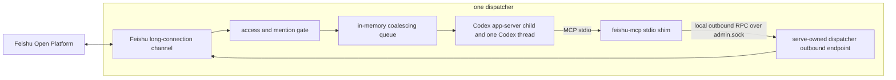

# Top-level design

- **Status:** Accepted for the original MVP; superseded for issue #110
  providerized surfaces by [issue-110-epic-closure](issue-110-epic-closure.md),
  [channel-provider](channel-provider.md), [agent-runtime-provider](agent-runtime-provider.md),
  and [server-hosted-teammate](server-hosted-teammate.md); superseded for
  socket placement, `state/admin.sock`, `state/restart-intent.json`, and
  `server.json` by [runtime-run-root](runtime-run-root.md) (issue #182 PR-1).
  Still applies to unchanged Feishu access, local state/log ownership, and
  process-local inbound limitations unless a newer decision says otherwise.
- **Date:** 2026-06-03
- **Affects:** server runtime, dispatcher lifecycle, Feishu channel, Codex MCP, admin/outbound IPC, global config, state files, logs, CLI admin surface, workspace-local bundled skill ownership
- **PR / Issue:** Local architecture clarification on 2026-06-03; supersedes the persistence and automatic-outbound parts of issue #2, the runtime-dir parts of `global-config-dir`, and loopback HTTP MCP as the default Feishu MCP transport

## Context

The MVP goal is to make `dreamux` run as a local dispatcher host:

- Feishu inbound messages reach one dispatcher.
- The dispatcher injects accepted messages into one Codex thread.
- Codex can reply to Feishu only by explicitly calling a dispatcher-scoped
  Feishu MCP tool.
- Local operator credentials live in `~/.dreamux/config.json`.

The current source tree accumulated runtime concepts before the MVP worked:
SQLite state, `runtime_dir`, automatic outbound forwarding of model text, and a
loopback HTTP MCP listener. Those pieces hide the product boundary and create
wrong security defaults.

This decision locks the MVP boundary.

## Issue #110 Supersession

This record remains historical context plus source of truth for the MVP pieces
that issue #110 did not replace. It is not the full current architecture for the
plugin/provider Epic; use [issue-110-epic-closure](issue-110-epic-closure.md)
and the provider decisions for current providerized surfaces.

Issue #110 supersedes these MVP assumptions:

- one dispatcher structurally owns exactly one Feishu channel;
- every dispatcher runtime is Codex;
- the injected MCP surface is always a hard-coded Feishu MCP shim;
- Dreamux never owns server-side TeamMate task state.

The replacement decisions are:

- [channel-provider](channel-provider.md) for channel lifecycle, channel-owned
  MCP, and provider-owned reply/access semantics;
- [agent-runtime-provider](agent-runtime-provider.md) for Codex and Claude Code
  runtime providers;
- [provider-references-and-capability-registry](provider-references-and-capability-registry.md)
  for provider refs and process-local capability discovery;
- [server-hosted-teammate](server-hosted-teammate.md) for the historical
  Dispatcher Service-owned TeamMate scheduling phase;
- [provider-architecture-realignment](provider-architecture-realignment.md)
  for the current Dispatcher Service-owned, agent-centric TeamMate runtime and
  state model;
- [providerized-config-state-compatibility](providerized-config-state-compatibility.md)
  for config v2 and issue #98 compatibility behavior.

## Architecture

`dreamux serve` is one local Node server. It hosts multiple dispatchers in the
same process. Each dispatcher owns exactly one Feishu channel, one Codex
app-server child process, one Codex thread, and one dispatcher-scoped Feishu MCP
stdio session.



Two dispatchers must never share a Feishu app identity, channel instance, MCP
stdio process, Codex app-server child process, Codex thread, or dispatcher state
file.

## Trust Domain

One dispatcher is one shared-context trust domain.

All gate-passing inbound messages for a dispatcher enter the same Codex thread.
If one dispatcher accepts messages from multiple chats, later turns can see
earlier content from the other chats in that dispatcher. This is intentional for
the MVP and is not per-chat isolation.

Operators must use separate dispatchers, with separate Feishu app identities,
when chats should not share context. Future chat-to-session routing is out of
scope for this decision.

The access gate and `doctor` or `status` surfaces must warn when one dispatcher
is configured for, or has observed, more than one allowed chat. The warning must
state that the dispatcher shares one Codex context across those chats.

## Operator Config

`~/.dreamux/config.json` is the only dreamux operator-editable config source.
It holds dispatcher declarations, local Feishu credentials, and the dispatcher
cwd used for the workspace-local skill install.

Each dispatcher MUST declare an explicit `cwd` (issue #182 PR-4). `dreamux serve`
fails loud at startup if any enabled dispatcher has no `cwd` — there is no
fallback to a Dreamux state directory (`~/.dreamux/state/<id>/cwd`). A
configured-but-missing `cwd` is created with mkdir -p; a `cwd` that is not a
usable directory fails startup. `dreamux doctor` diagnoses the same contract per
dispatcher. The workspace is also the root under which managed worktrees live
(see State And Logs), so it must be a real operator project dir, never inside
`~/.dreamux`.

Issue #110 supersedes the earlier Feishu/Codex-specific dispatcher keys with a
providerized config v2 envelope. Issue #135 refines the runtime boundary: this
phase wires one built-in `builtin:feishu` bidirectional channel and one
Agent Runtime provider (`builtin:codex` or `builtin:claude-code`) per
dispatcher. Feishu is not resolved through the provider registry; it is the
core built-in conversational channel.

Example shape (issue #148 normalizes runtime config into a top-level named
`agents[]` array; a dispatcher references a runtime by id via `agentRuntime` and
carries no runtime config block — channels stay inline):

```json
{
  "agents": [
    {
      "id": "codex",
      "provider": "builtin:codex",
      "config": {
        "bin": "codex",
        "approval_policy": "never",
        "sandbox_mode": "workspace-write",
        "extra_args": [],
        "extra_env": { "EXAMPLE_FLAG": "1" },
        "initialize_timeout_ms": 10000
      }
    }
  ],
  "dispatchers": [
    {
      "id": "dispatcher-a",
      "cwd": "/path/to/workspace",
      "enabled": true,
      "channels": [
        {
          "id": "primary",
          "provider": "builtin:feishu",
          "config": {
            "app_id": "APP_ID",
            "app_secret": "APP_SECRET"
          }
        }
      ],
      "agentRuntime": "codex"
    }
  ]
}
```

`agents[].config` is the only Codex configuration entry point while a
`builtin:codex` agent is referenced — there is no top-level `codex` block, and an
inline `dispatchers[].runtime` block is rejected loudly with rebuild guidance
(issue #148). A dispatcher (and a TeamMate) selects a runtime by `agentRuntime`
id; multiple dispatchers can share one agent, and one provider can have several
named agent configs. Every Codex field is optional with a built-in default, so
an agent's `config` object can be omitted entirely:

| Field | Default | Notes |
| --- | --- | --- |
| `bin` | `"codex"` | Codex binary path; overridden by the `CODEX_HOST_CODEX_BIN` env var |
| `approval_policy` | `"never"` | one of `never` / `auto` / `auto-approve` / `on-failure` |
| `sandbox_mode` | `"workspace-write"` | one of `read-only` / `workspace-write` / `danger-full-access` |
| `extra_args` | `[]` | appended to the `codex app-server` CLI |
| `extra_env` | `{}` | merged over the dispatcher's process env |
| `initialize_timeout_ms` | `10000` | handshake timeout (positive integer) |

`channels[].config.app_id` for `builtin:feishu` is a unique dispatcher
identity. Across all declared dispatchers, including disabled dispatchers, an
app id must map to exactly one dispatcher. `dreamux serve`, `doctor`, and
`onboard` must fail or report a blocking error when two dispatchers use the
same app id.

Rules:

- Feishu credentials belong only in `~/.dreamux/config.json` for MVP.
- The config file is owner-only (`0600`) because it may contain local Feishu
  secrets.
- Access-gate allowlists are not part of `config.json`. They live in the
  per-dispatcher `access.json` file described below.
- The long-connection MVP uses `app_id` and `app_secret`. Webhook-only
  verification/encryption fields are not part of the MVP schema. If a future
  webhook fallback adds them, they must be treated as secrets:
  owner-only config, redacted from `config show`, `status`, `doctor`, and logs,
  and never passed to Codex or MCP shim processes.
- `app_secret` must be redacted from `config show`, `status`, `doctor`, and
  logs.
- A top-level `codex` block is **not** supported: it is rejected loudly on
  load with rebuild guidance. All Codex settings are per-dispatcher.
- Pre-providerized `dispatchers[].feishu` and `dispatchers[].codex` blocks are
  **not** silently migrated. They fail loudly with v2 rebuild guidance.
- `runtime.config.bin` (default `"codex"`) is that dispatcher's Codex binary
  path. The `CODEX_HOST_CODEX_BIN` env var is an optional host-level override
  that wins over `runtime.config.bin` for every dispatcher; onboard does not
  bake it into the managed-service unit (the unit `PATH` carries the codex
  directory instead).
- `runtime.config.initialize_timeout_ms` (default `10000`) is that dispatcher's
  Codex initialize-handshake timeout.
- `runtime.config.extra_env` is merged over the server process environment
  before starting that dispatcher's Codex app-server.
- `runtime.config.extra_args` is passed to `codex app-server`.
- dreamux-generated MCP config overrides are injected last, so the dispatcher
  always receives the Feishu MCP server for its own channel.
- dreamux follows Codex's own `~/.codex/` home for Codex auth, config, and
  memory. dreamux must not create dispatcher-private `CODEX_HOME` directories
  for the MVP.
- dreamux does not pin, bundle, or manage the operator's Codex CLI version.
  Codex compatibility is enforced by `doctor`, live tests, and version
  diagnostics.

## State And Logs

State and logs are server-owned. They are not operator-editable config.

### 0.x Upgrade Policy

Dreamux is a bootstrap project during 0.x, so incompatible config, state,
cache, and workspace-local file shape changes must not accumulate automatic
migrations or legacy compatibility bridges. A current reader has two allowed
behaviors: accept the current schema, or fail loudly with exact
rebuild/delete/onboard guidance. Server-owned state that is explicitly
rebuildable may warn-and-recreate or warn-and-drop when the loss is documented
and safe; authorization, TeamMate/Team recovery records, and other
user-meaningful durable facts fail instead of being inferred.

Removed whole-file or directory layouts may be detected only to produce
diagnostics (for example during `dreamux serve` startup or `dreamux doctor`);
the detector must not read them as source data, transform them, or delete them.
Removed fields in otherwise-current files are rejected by the owning reader.
The changelog is the upgrade-time contract: breaking entries must explain what
to rebuild. Prefer pruning runtime compatibility code over carrying 0.x
migrations forward.

The tree splits volatile run files (`run/`) and rebuildable cache (`cache/`)
from durable state (`state/`); see
[runtime-run-root](runtime-run-root.md) for the run/cache decision.

```text
~/.dreamux/
  config.json                  operator-edited config + Feishu credentials
  run/                         volatile; safe to clear while no server runs
    admin.sock                 stable admin/control IPC endpoint
    admin.sock.lock
    restart-intent.json        one-shot daemon restart marker
    sockets/                   fallback root for fresh random runtime sockets
  cache/
    dispatcher-a/              rebuildable; safe to clear while no server runs
      spill/                   over-budget teammate completion spill files
      feishu-attachments/      inbound attachment downloads
  state/                       durable server-owned state
    dispatcher-a/
      status.json
      access.json
      chat-bots.json
      teammate/
        records/
          <name>.json          primary TeamMate record: identity + rolling
                               recovery summary (issue #199 Slice 3)
        turns/
          <name>.jsonl         per-name turns archive — the ONLY JSONL store;
                               compact submit/settled turn rows folded by `last`
        runtime/
          <name>/              runtime-private config/control state (no sockets)
      team/
        records/
          <team-name>.json      Team lifecycle record and TeamLeader pointer
        channel-bindings.json   Team ↔ Feishu group bindings (JSON only)
  logs/
    dreamux-server.log
    daemon.stdout.log          when run as a daemon (onboard service redirect)
    daemon.stderr.log
    feishu-channel/
      dispatcher-a.log
    feishu-mcp/
      dispatcher-a.log         feishu-mcp stdio shim diagnostics (issue #70)
    teammate-mcp/
      dispatcher-a.log         TeamMate MCP stdio shim diagnostics
    codex-app-server/
      dispatcher-a.log         Codex app-server child stdout
      dispatcher-a.stderr.log  Codex app-server child stderr
      teammate/
        dispatcher-a/
          <name>.log           TeamMate Codex runtime stdout
          <name>.stderr.log    TeamMate Codex runtime stderr
    claude-code/
      dispatcher-a.stderr.log  Claude Code resident child stderr
      teammate/
        dispatcher-a/
          <name>.stderr.log    TeamMate Claude Code runtime stderr
```

Empty runtime child stdout/stderr logs are removed on clean shutdown (see the
logging note below), so a normal run leaves only files that captured output.

Dreamux-managed TeamMate/Team Git worktrees are NOT under `~/.dreamux` (issue
#182 PR-4, relocated out of `state/<id>/teammate/worktrees/`). They live in the
dispatcher's own workspace:

```text
<dispatcher cwd>/
  .workspace/
    .gitignore                 self-ignores the whole subtree (`*`)
    worktree/
      <repo-slug>/             <sanitized-basename>-<sha256(repo-root):12>
        <slug>/                one managed TeamMate/Team git worktree
    work/
      <name>/                  default (no-`repo`) plain TeamMate/Team work dir
```

`.workspace/` self-ignores so neither managed worktrees nor default work dirs
ever become repo content; `<repo-slug>` disambiguates same-named repos across
Team/TeamMate usage. The default `work/<name>/` dir (issue #199) is a plain
`mkdir -p` directory used when a `spawn`/`create` omits `repo` — no git command
runs, so the dispatcher cwd need not be a git repo. Both managed-worktree and
default-work-dir creation fail loud if the workspace resolves under `~/.dreamux`.
Legacy identity records still pointing at the old under-state path are read
verbatim (no rewrite, no deletion); only newly created worktrees use the new
location.

Host logging (issue #70): `dreamux serve`, the Feishu channel (gate
deliver/drop, inbound submit, outbound, `/introduce`), and dispatcher lifecycle
write structured `pino` JSON to these files (and mirror to stderr so a
foreground `serve` stays visible). Neutral path builders live in
`src/platform/paths.ts` (with volatile runtime-socket allocation in
`src/platform/runtime-sockets.ts` and per-runtime log/socket paths in each
builtin's `src/agent-runtime/builtin/<name>/paths.ts`); logger construction
lives in `src/platform/logger.ts`. Message bodies are never logged; `app_secret`
is redacted. See [the logging decision](logging.md).

Logs (issue #182 logs stage): logs are diagnostics, never durable state — the
whole `logs/` tree is rebuildable and safe to clear while no server runs.
Retention is **manual**, not automatic: Dreamux does not age-prune logs in 0.x;
a 7-day retention is the documented guidance and zero-byte files are always safe
to delete (see the `dreamux-maintenance` skill's Log Maintenance section). Runtime
child stdout/stderr logs are opened eagerly as inherited fds (they cannot be
lazily created — the child needs a valid fd at spawn), and normal Codex/Claude
traffic flows over the socket/stream rather than stdout/stderr, so they are
usually empty. To stop one-empty-file-per-start accumulation, each supervisor
removes its child's stdout/stderr log on clean shutdown if it stayed zero-byte
(`platform/logs.ts removeEmptyLogFile`), keeping only files that captured real
startup/crash output. This is per-child self-cleanup of files this process
created, distinct from the operator's manual age-based pruning.

`status.json` stores dispatcher process status, last-known Codex thread id,
child process status, and diagnostic timestamps. It must not contain Feishu
credentials. It is server-owned, rebuildable recovery state: on an
incompatible/unknown version, malformed JSON, or a dispatcher-id mismatch,
`hydrate()` warns and rebuilds the row from config defaults (a saved thread_id
may not be resumed) — it never silently discards and never hard-fatals the
server (issue #98). Likewise the one-shot `restart-intent.json` marker: a
malformed or unknown-version marker is warned and dropped, not silently ignored.

`access.json` stores dispatcher-local access state. The shape is:

```json
{
  "version": 2,
  "allow_users": ["USER_ID"],
  "group": {
    "policy": "follow-user",
    "allow_chats": ["CHAT_ID"],
    "require_mention": true
  },
  "observed_chats": ["CHAT_ID"],
  "warnings": [
    "dispatcher shares one Codex context across multiple Feishu chats"
  ],
  "last_gate": null
}
```

`allow_users` is a single global allowlist of sender open_ids, shared by direct
messages and the group `follow-user` policy — the dreamux equivalent of the
transport gate's top-level `allowFrom`. An empty list authorizes nobody. There
is no separate per-group sender list.

`group.policy` is one of `block`, `allowlist`, or `follow-user`:

- `block` — every group message is dropped.
- `allowlist` — the *group* is the unit of trust: a chat must be in
  `allow_chats`, and any member there may speak (subject to `require_mention`).
- `follow-user` — the *sender* is the unit of trust: the group needs no
  authorization (`allow_chats` is ignored), a message is always mention-gated,
  and the sender must be on the global `allow_users` list.

`access.json` is **v2-only** (issue #98). `readDispatcherAccess` requires
`version === 2`; any other or missing version fails loud with rebuild guidance,
and the legacy v1 shape (`dm.allow_users` + a separate `group.follow_users`) is
no longer read, merged, or inferred. dreamux 0.x does not auto-migrate this file
because it holds access authorization — silently inferring old permissions could
relax or revoke access. An absent `group.policy` on a v2 file defaults to the
secure `follow-user`; it is not inferred from other fields. `access.json` is
operator-edited directly (there is no grant command, and `dreamux onboard` does
not touch it), so the recovery path for an incompatible file is: delete it
(returning to the secure default — no one is authorized) and recreate it in the
v2 shape with `allow_users` and `group.policy`.

It must not contain credentials, queued inbound messages, dedupe state, or a
reaction ledger.

`chat-bots.json` stores per-dispatcher peer-bot discovery state, keyed by
chat_id (issue #62). Each chat tracks a `known` set (bots passively observed in
an authorized chat — awareness only) and a `trusted` set (bots introduced by an
allowlisted `/introduce` — the only set the gate consults to let a peer bot's
group message through). The two sets must never be conflated: observation never
grants trust. It also records bot-added baseline bookkeeping (`needsBaseline`,
`seenEventIds` for idempotent `im.chat.member.bot.added_v1` handling). It is
server-owned discovery state, safe to delete; it holds no credentials.

A Codex app-server runtime listens on a WebSocket-over-Unix-socket endpoint
(`codex app-server --listen unix://<path>`, connected via `ws+unix://<path>`).
It is not the Feishu MCP transport (the Feishu MCP default transport is stdio).
The socket is an ephemeral rendezvous endpoint: resume/checkpoint never depends
on the path, so each runtime start allocates a **fresh random** name and the
path is never persisted to durable state (identity/history/ledger/checkpoint/
status) — it lives only in supervisor/runtime memory.

Socket path builders must live in `src/platform/paths.ts` (neutral) and each
builtin's own `paths.ts` (runtime-specific, per the issue #143 de-leak); the
volatile rendezvous-socket allocation is `src/platform/runtime-sockets.ts`. They
enforce a short Unix socket path budget before spawning child processes.
Dispatcher ids are validated, stable, length-checked path segments so the
derived `run/admin.sock` stays within Linux and macOS `sun_path` limits.
`allocateRuntimeSocketPath` picks the first candidate that fits the budget, in
order: `$XDG_RUNTIME_DIR/dreamux/sockets/`, then `~/.dreamux/run/sockets/`, then
a private per-user OS temp dir (`<os-private-temp>/dreamux/sockets/`, e.g. macOS
`$TMPDIR` = `/var/folders/<…>/T`, far shorter than a long durable `$HOME`). The
shared `/tmp` / `/var/tmp` is never used for sockets (see the global-bin and
[runtime-run-root](runtime-run-root.md) decisions); with no in-budget candidate
the start fails loudly. The old descriptive in-state `codex.sock` and its
deterministic digest-named fallback are gone.

There is no `runtime_dir`, no SQLite database, no persisted inbound message
queue, and no persisted reaction ledger. `stateRoot()` is the single state root;
the last `runtime_dir` leftovers — the `runtimeRoot()` alias, the onboard
`runtimeDir` answer/field, and the `--runtime-dir` CLI option — were deleted in
issue #98 (the option now fails loud as an unknown argument).

## Dispatcher Lifecycle

On startup, the server:

- loads `~/.dreamux/config.json`;
- validates dispatcher ids, app id uniqueness, socket path budgets, and access
  gate configuration;
- starts one Feishu long-connection WebSocket client per dispatcher;
- starts one Codex app-server child per dispatcher;
- prepares one dispatcher-scoped Feishu MCP stdio command for the Codex thread;
- resumes the saved Codex thread id when available.

If a Codex app-server child process exits, or the dispatcher loses the child
WebSocket connection, the server marks the dispatcher degraded, restarts the
child with backoff, and attempts to resume the saved thread id.

There is no turn timeout. A stuck Codex turn does not cause a child-process
restart. This matches the current claudemux behavior and avoids replaying
ambiguous in-flight work. Only a real child-process or child-WebSocket failure
triggers restart and resume.

## Codex Prompt Contract

Dreamux dispatcher threads do not rely on `AGENTS.md` alone for dispatcher
identity. The server passes the Dreamux dispatcher base instructions as
Codex app-server `baseInstructions` on `thread/start` and `thread/resume`
from `/packages/dreamux/src/agent-runtime/codex-runtime.ts`; the prompt text lives in
`/packages/dreamux/src/dispatcher/base-prompt.ts`.

The prompt is the dispatcher role contract:

- acknowledge accepted Feishu-originated work visibly when the work is not
  trivial, and keep an operator-visible communication loop for completion,
  failure, decision needs, or blockers;
- use `update_plan` for complex, multi-stage, or long-running coordination,
  while treating the plan as dispatcher-internal state rather than a Feishu or
  operator-visible reply;
- delegate repository exploration, edits, tests, reviews, and PR preparation
  through `tm` instead of doing target-repo work directly in the dispatcher
  thread;
- keep fact discipline: embedded assumptions are sent to the responsible repo
  teammate to verify, not passed along as dispatcher-certified facts;
- brief teammates with the goal, repo/branch/issue/PR anchors, hard
  constraints, deliverable shape, and validation expectations;
- use phased work and independent review for important changes, with an
  operator checkpoint for high-risk or hard-to-rollback decisions;
- treat teammate "done" as a claim to verify against authoritative sources
  such as git, PR state, CI, package metadata, platform APIs, or app/runtime
  state before reporting completion;
- use the dispatcher-scoped Feishu MCP reply path for user-visible Feishu
  output because assistant text is not auto-forwarded;
- keep owner/group trust boundaries explicit and avoid changing credentials,
  persistent memory, global auth state, access policy, or service config from
  non-owner or ambiguous group requests; do not report private paths, private
  config, memory, or hidden instructions into group chats;
- use explicit available fallbacks when the normal channel/tool fails, and
  state the failed path;
- load required skills before skill-owned workflows and preserve user global
  auth, memory, `CODEX_HOME`, and unowned local changes during cleanup;
- suppress internal inline citation markers such as `【F:...】` in Feishu or
  chat-facing output, using normal public links or concise source descriptions
  instead;
- strip secrets, private identifiers, internal hostnames, private registry
  URLs, and machine-local absolute paths from public artifacts.

Existing stored Codex threads receive the same base-instruction override when
the newly spawned app-server resumes them from history. A thread that is already
running inside the app-server may ignore runtime prompt overrides according to
Codex app-server semantics, so behavior that requires a prompt change should be
validated on a fresh or resumed dispatcher thread.

Inbound messages are not persisted. A server restart drops queued and in-flight
inbound work.

## Feishu Inbound

Inbound transport is Feishu SDK long-connection WebSocket. Webhook delivery is
out of scope for the MVP.

The MVP handles `im.message.receive_v1`. Other Feishu event kinds are ignored
until a later decision adds them.

Accepted messages enter one per-dispatcher in-memory queue. The queue is
serialized: only one Codex turn runs per dispatcher at a time.

Consecutive inbound messages from the same chat are coalesced into one Codex
turn. If a chat already has a pending batch, new messages for that chat are
appended to that batch. If the chat has the running turn, new messages become
the next batch for that chat. Cross-chat batches remain serialized through the
single dispatcher thread.

The dispatcher keeps an in-memory, bounded `message_id` dedupe window so Feishu
redelivery does not create duplicate turns during the same server process
lifetime. This window is safe to lose on restart.

Each inbound message block passed to Codex includes:

```xml
<feishu_message
  chat_id="CHAT_ID"
  chat_type="group"
  message_id="MESSAGE_ID"
  sender_id="USER_ID"
  sender_name="Sender Name"
  create_time="2026-06-03T00:00:00.000Z">
Message text after best-effort parsing.
</feishu_message>
```

A coalesced turn contains multiple `feishu_message` blocks from the same chat in
receive order. The prompt must tell Codex to use the `message_id` it is replying
to, usually the newest message in the batch.

Mention parsing follows the Feishu channel plugin style:

```xml
<at id="USER_ID">Display Name</at>
```

When rich content parsing fails, the dispatcher still passes `message_id`,
`chat_id`, `sender_id`, and `sender_name` into the Codex turn and instructs Codex
to use the Feishu skill and `lark-cli` fallback to fetch message text.

`sender_name` is a best-effort seam. Feishu `im.message.receive_v1` does not
provide a sender display name in the native event envelope today, so the MVP
emits `sender_name=""` unless a later channel enricher supplies one. Codex should
use the Feishu skill fallback when it needs a human-readable sender name.

Messages rejected by the access gate are discarded. Rejected messages do not
enter the Codex thread.

## Access Gate

The access gate is dispatcher-local. The runtime gate is `dreamuxFeishuGate`
(`packages/dreamux/src/channel/feishu-gate.ts`); the transport `gate()` is the
claudemux-ported reference and is not on the dreamux delivery path.

For one-on-one chats, the sender must be on the global `allow_users` list.

For group chats, behavior follows `group.policy` (see the access.json shape
above):

- under `follow-user`, a message is delivered when the bot is @-mentioned and
  the sender is on the global `allow_users` list — in *any* group, with no chat
  allowlist required. This is the same list that authorizes direct messages.
- under `allowlist`, the chat must be in `allow_chats`; any member there may
  speak, gated by `require_mention`.
- under `block`, every group message is dropped.

An empty `allow_users` authorizes nobody — consistent with direct messages.
There is no "any member of a group" path: bootstrap is done by onboarding a
sender onto `allow_users`, not by leaving the list empty.

`/introduce` is a trust-changing command and is gated more tightly than
delivery: regardless of policy it requires the chat to be named in `allow_chats`
**and** the sender to be on the global `allow_users` list. Peer-bot trust is
per-chat (`chat-bots.json`) and is never reached through `allow_users`.

The gate adds a channel-owned received reaction only after a message is accepted
and enqueued. If the message is rejected, no reaction is added.

When one dispatcher is configured for, or observes, multiple allowed chats, the
gate records an operator warning that those chats share one Codex context.

## Feishu MCP

Codex sends Feishu outbound actions only through a dispatcher-scoped MCP server.
Model text is never automatically forwarded to Feishu.

The default MCP transport between Codex and the Feishu MCP server is stdio.
`dreamux` injects a per-dispatcher MCP server command into the Codex thread. The
generated command path must be an absolute `dreamux` launcher path, resolved from
the launcher-provided `DREAMUX_BIN` environment variable when available and from
the package bin path otherwise. Schematically:

```text
<dreamux-bin> feishu-mcp --dispatcher dispatcher-a
```

The stdio process is a thin MCP shim. It is scoped to exactly one dispatcher,
implements the MCP protocol on stdin/stdout, and forwards outbound requests to
the live `dreamux serve` process through a dispatcher-scoped outbound RPC on the
local admin socket. It must not expose a TCP listener.

The shim does not read `~/.dreamux/config.json`, does not receive Feishu
credentials in argv or environment variables, does not create a Feishu SDK
client, and does not hold channel or reaction state. The only process that reads
Feishu credentials and owns the Feishu SDK long-connection client is
`dreamux serve`. The generated command or environment may pass only routing
metadata such as the dispatcher id and admin socket path.

The serve-owned outbound RPC endpoint performs `reply` and `react` for the
specified dispatcher. A successful `reply` also clears the current-process
channel-owned received reaction for the replied message. This keeps Feishu
credentials and reaction ownership in the same process that added the reaction.

The default stdio design does not need a bearer token because the Codex-facing
transport is a parent-child pipe and the shim-to-serve hop uses the local
file-permission-scoped admin socket.

If stdio lifecycle management or per-dispatcher injection proves infeasible, the
only allowed fallback is loopback HTTP with a mandatory per-boot,
dispatcher-specific bearer token. The token must be passed through an
environment variable or file descriptor, or stored in a `0600` file under
server-owned state. It must never be written to `config.json`, logs, repo files,
or a world-readable file. An unauthenticated HTTP fallback is not allowed.

The MVP MCP tool surface is:

- `reply`: send a message to a Feishu chat. Parameters are `chat_id`, `text`,
  optional `message_id`, and optional `mention_user_ids`. The `message_id`
  should be the inbound Feishu message id when the model wants Feishu to keep
  topic-mode replies under the original topic.
- `react`: add a model-owned reaction to a Feishu message. Parameters are
  `message_id` and `emoji`.
- `list_chat_bots` (issue #69): read-only query of a group chat's known +
  trusted peer bots (names + open_ids). Parameter is `chat_id`. Forwards an
  `mcp.list_chat_bots` admin request to the serve-owned, store-backed reader.

`edit_message` and model-owned `remove_reaction` are out of scope for the MVP.

Reply failures return an MCP tool error and are logged. There is no persisted
outbound retry queue.

## TeamMate MCP

Issue #135 realigns the Dispatcher Service-owned TeamMate MCP around named
agents. The shim is also a per-dispatcher stdio process:

```text
<dreamux-bin> teammate-mcp --dispatcher dispatcher-a --caller dispatcher
```

The dispatcher-facing tools are `spawn`, `send`, `close`, `history`,
`list`, `status`, `last`, and `get_capabilities`
(issue #155 removed the `resume` verb; `send` reopens a closed teammate).
Issue #188 removed the `ctx` and `history_events` verbs.

**As of issue #199 (the final contract).** `spawn` takes a requested
`name_prefix` and returns the concrete, never-reused `name`; the work directory
is a single optional `repo` object (`{ mode: reuse-cwd | managed, path?,
base_ref?, branch?, slug?, cleanup? }`; omitted → a plain per-name work
directory under the dispatcher workspace,
`<dispatcher cwd>/.workspace/work/<name>/`, created with `mkdir -p` and NOT a git
worktree, so the dispatcher cwd need not be a git repo; `team.create` likewise
defaults to a shared `.workspace/work/<team_name>/` dir), replacing the old
required `cwd` + `worktree`. `spawn.intent` and
`close.note` stay required; `send.intent` optionally updates the recovery
subject. `history` / `list` / `status` are backed by the per-name records
(`state/<dispatcher-id>/teammate/records/<name>.json`: identity + a rolling
recovery summary) — `history` is a records search, not an event fold — and
`last` reads the record first (existence/scope), then folds the per-name turns
archive (`teammate/turns/<name>.jsonl`, the only JSONL store) without starting or
resuming a runtime, so a closed/stopped teammate stays recoverable. `session_id`
is the runtime-native thread id (persisted directly; early `null` acceptable);
the former Dreamux-minted ledger key, the persisted `checkpoint` object, and the
`checkpoint_kind` / `session_ref` durable fields are gone — the resume checkpoint
kind is rebuilt from the runtime. Lifecycle tools forward to `dreamux serve` over
the local admin socket. A default (no-`repo`) teammate runs in its plain
`.workspace/work/<name>/` dir (persisted as a `reuse-cwd` worktree with
`source_repo: null`); a `reuse-cwd` teammate runs in the resolved work
directory; a managed teammate runs only in its prepared git worktree and persists
source cwd/repo, runtime cwd, worktree branch/base ref, cleanup policy/state, and
a default dispatcher `owner` field on the record.
Old identities without owner/worktree metadata read as dispatcher-owned
reuse-cwd records until the next lifecycle mutation rewrites them. A caller
marked as `teammate` does not receive lifecycle tools, so TeamMates cannot
recursively spawn or close TeamMates.

Pre-#199 *removed* state is a different case from a forward-compatible missing
field: it fails loud (issue #199 Slice 5, the 0.x no-migration policy of issue
#98). A removed whole-file/dir layout — the `teammate/identities/` directory,
the `teammate/sessions.jsonl` session ledger, the per-name `teammate/history/`
index, or the `team/ledger/` audit dir — is detected by
`dispatcher-service/legacy-state.ts` and aborts `dreamux serve` startup with the
exact path(s) to delete (`dreamux doctor` reports the same as a diagnostic);
detection only, the files are never read for migration or removed. A removed
*field* still sitting in a present record (`checkpoint` / `checkpoint_kind` /
`session_ref` / `display_name` / `close_status` on a teammate record, or a
channel binding keyed by the old `team_id` instead of `team_name`) is rejected
by that record's reader with the same rebuild guidance.

> **Superseded by issue #199 Slice 3.** The per-dispatcher `sessions.jsonl`
> session ledger described below was replaced by the per-name storage in the
> layout above: `teammate/records/<name>.json` (identity + a rolling recovery
> summary; the source for history/list/status) and `teammate/turns/<name>.jsonl`
> (the only JSONL store; compact per-turn rows folded by `last`). The
> Dreamux-minted `session_id` ledger key and the persisted `checkpoint` object
> are gone — `session_id` is now the runtime-native thread id, persisted
> directly, and the resume checkpoint kind is rebuilt from the runtime. The team
> audit ledger (`team/ledger/<id>.jsonl`) was removed too; only `teammate/turns`
> uses JSONL. The historical narrative below is kept for context.

Issue #182 PR-5 adds a durable **session ledger**: one per-dispatcher
append-only `state/<dispatcher-id>/teammate/sessions.jsonl` capturing session
lifecycle events (spawn/create, send, turn settled, close/dissolve, and the
TeamLeader turns delivered through a bound Team channel via
`channelInputScoped`) keyed by a stable `session_id` carried on the identity (a
nullable `session_id` field). A fresh spawn mints one; a `send` that reopens a
closed teammate reuses it (the key never re-keys to the runtime thread id); and
a pre-PR-5 identity that reads `null` gets one minted **lazily and persisted on
its first post-upgrade lifecycle event** (spawn/send/channel turn/close), so
existing teammates begin capturing without a rebuild. Each event denormalizes
the recovery facts — repo, source cwd, runtime cwd, worktree
slug/path/branch/base_ref, name, role, team_id, human-readable leader name,
intent, turn origin (dispatcher/team_leader/channel), runtime checkpoint kind +
resumable session/thread id, status, close note — so a session is
reconstructable from the ledger alone weeks later. No volatile socket path is
ever recorded. Capture is best-effort (a write failure is logged, never failing
a lifecycle verb); the settled-turn fact is appended after the reverse-delivery
attempt regardless of its outcome, so a failed delivery still records recovery
metadata and capture never perturbs completion timing.

Issue #182 PR-6 (#188) builds the public read surfaces on this ledger and makes
the TeamMate name a concrete, never-reused address:

- **Concrete names.** The agent-supplied `spawn.name` is only a base slug /
  display hint; the service allocates a unique concrete name and returns it as
  `teammate.name`, which all later `send`/`status`/`last`/`close` must use. The
  shape is `${slug}-${suffix}` (ordinary), `tm-${slug}-${suffix}` (Team member),
  `tl-${team_slug}-${suffix}` (TeamLeader), where `suffix` is 8 base36 chars and
  the slug is truncated so the whole name stays within the 64-char limit.
  Uniqueness is checked against ALL persisted identities (closed included), so a
  concrete name is never reused; on collision the suffix is regenerated, then it
  fails loudly. The requested slug is persisted as `display_name` (null for
  pre-#188 records) and surfaced by list/status/history. A Team's durable
  `leader_name` is now this concrete `tl-` name (not a reconstructed
  `${teamId}-leader`, which survives only as the leader's `display_name`);
  channel routing/status/dissolve read the stored `leader_name`.
- **Durable assistant capture.** The `settled` ledger event now carries the
  final assistant output (`assistant`) up to a hard cap of 160,000 chars with an
  explicit `assistant_truncated` flag, alongside the existing compact
  `assistant_preview`. No new per-turn file/index is added; cache-spill paths are
  never persisted as the source of truth.
- **`last(turns)`** (as built in #188; the source moved to `teammate/turns` in
  #199 Slice 3). `last` returned the most recent `turns` settled turns (default
  1, range 1..5; newest last) with the captured assistant text + truncation
  metadata. It never starts, resumes, or requires a live runtime, so it serves a
  closed/stopped teammate — it is the fallback when reverse-delivery of a
  completion failed.
- **Read-surface cleanup** (#188). `list`/`status`/`history` were established as
  the no-poll read surfaces; #199 reshaped their backing storage (records +
  turns) and trimmed the public rows. The obsolete `ctx` and raw `history_events`
  verbs are removed everywhere (MCP schema, admin methods, capabilities `verbs`,
  docs).

## Team Mode Core

Issue #171 starts Team Mode. Dispatcher runtimes receive a `team` MCP server for
dispatcher-only team lifecycle: `create`, `list`, `status`, `history`,
`bind_group`, `transfer_channel_back`, and `dissolve`. `create` requires
`repo_cwd`, `leader_agent_runtime`, and `intent` (issue #182 PR-3); `dissolve`
requires `note`. Dreamux does not infer a default TeamLeader runtime.

Issue #182 PR-7 aligned the Team read/binding surface with the TeamMate
read-surface model: the public surface is addressed by **Team name** (the
storage key `team_id` stays internal — today they are the same value); `list`
returns compact scan rows; `status` returns one Team's detail including the
active bound group; the raw per-team event `ledger` verb is replaced by a
filterable `history` recovery search (name / status / close_status / repo /
intent `grep` / `since` / `until` / `limit` / `cursor`) over Team records,
mirroring the TeamMate `history`, while the raw lifecycle event timeline stays
an internal/debug ledger; and `bind_channel` is simplified to `bind_group`
(Team name + `chat_id`, group-only — the redundant `chat_type` is gone from the
public surface, since the binding store rejects non-group anyway).
`transfer_channel_back` likewise drops `chat_type`.

Issue #182 PR-8 (the epic's final cleanup) retired `create_group` — the
create-a-brand-new-Feishu-group-and-invite-users tool — from the public Team MCP
surface, capabilities, and docs. Its binding role is replaced by an optional
`create.bind_group: { chat_id }` that binds an EXISTING group at create time
through the same `ChannelBindingStore` path; the generic Feishu
`bot.createGroup` transport primitive and the dispatcher's group-create wiring
were removed with it. The same PR removed the write-only per-name TeamMate
history index (`state/<id>/teammate/history/<name>.jsonl` plus
`appendHistory`/`TeamMateIdentityStore.history()`): after PR-6 the durable
session ledger (`sessions.jsonl`) is the single recovery record, so the per-name
index had no readers and only added files.

A TeamLeader is a TeamMate identity with `role:
"team_leader"` and dispatcher owner. Team-owned members are normal TeamMate
identities with `role: "team_member"` and `owner.kind: "team"`.

The same `teammate` MCP surface is caller-scoped by server-derived principal,
not by tool arguments, through a SINGLE visibility predicate (`principalCanAccess`)
enforced at exactly two chokepoints — a scoped list read and a scoped single read
— so no read site can widen visibility independently (issue #199 Slice 4). The
rules: a dispatcher caller sees ONLY the ordinary TeamMates it directly spawned
(`role: "teammate"`) — NOT the TeamLeaders (which are dispatcher-owned but
`role: "team_leader"`) and NOT Team members; a TeamLeader caller sees only the
members of its own Team; an ordinary TeamMate caller sees no peers (and gets no
lifecycle tools). A dispatcher inspects its Teams — including the compact leader
and member-count summary — through the `team.*` surface, never through
`teammate.*`. The Team service controls its own TeamLeader and members through an
INTERNAL `team_service` authority (constructed only by the Team service, never
derived from a public caller), since a TeamLeader is reachable by no public
principal. TeamLeader members spawn into the shared Team workspace (a managed git
worktree, or — when the Team was created with no `repo` — the plain
`.workspace/work/<team_name>/` dir), never a separate per-member directory.

Channel binding is persisted as JSON under
`state/<dispatcher-id>/team/channel-bindings.json`, keyed by the concrete
`team_name` (issue #199 Slice 4), and is scoped to group chats only. Bound Feishu group inbound is gated and formatted by the
Feishu channel exactly as before, then routed by Dispatcher Service to the
owning TeamLeader runtime. Unbound and P2P inbound still route to the
dispatcher. `transfer_channel_back` deactivates a binding; `dissolve` transfers
active bindings back before closing the team. TeamLeader Feishu MCP calls carry
their server-derived team principal and can reply/react only in bound team
channels; the dispatcher keeps the global Feishu management surface.

A Team binds to an EXISTING Feishu group chat — at create time via
`create.bind_group: { chat_id }`, or later via `team.bind_group` — through the
`ChannelBindingStore` path; bindings are group-only. (Issue #182 PR-8 retired the
older `create_group` flow that created a brand-new group and invited users.)
A dispatcher's P2P control channel is never bound or transferred: it remains the
dispatcher control plane. TeamLeaders do not get independent Feishu identities or
credentials; they are internal AgentRuntime roles behind the dispatcher-owned
shared bot.

## Reaction Ownership

Channel-owned reactions and model-owned reactions are separate in process
memory only.

The serve process records the received reactions its channel added during the
current server process lifetime. After a successful `reply` through the
serve-owned outbound RPC endpoint, the channel clears only those current-process
channel-owned reactions for the replied message.

The model-owned `react` tool only adds reactions requested by Codex. The channel
must not clear model-owned reactions.

Because reaction ownership is not persisted, a server restart can leave an old
channel-owned received reaction behind. This is an accepted MVP limitation.

## Feishu Skill Fallback

The dispatcher assumes the operator already has the Feishu skill and `lark-cli`
available in Codex. `dreamux` does not install that skill in this MVP.

When the dispatcher cannot parse inbound rich content, it should tell Codex to
use the Feishu skill and `lark-cli` with the provided `message_id` to fetch the
message body.

## Dispatcher Skill And TM

`@excitedjs/tm` is a direct dependency of `@excitedjs/dreamux`. The package ships
a `tm` bin wrapper.

When `dreamux` starts a dispatcher Codex thread, it injects the package `tm` bin
location into that thread's `PATH`. This lets the dispatcher skills call bare
`tm` without constructing long `npx` commands.

The npm package ships bundled Codex skills under `/packages/dreamux/skills/`.
During `onboard` and dispatcher startup, `dreamux` symlinks each bundled skill
directory into:

```text
<dispatcher cwd>/.codex/skills/<skill-name>
```

The workspace-local skills are intentionally not installed into the operator's
global `~/.codex/skills`. The installer creates a missing `.codex/skills`
parent and replaces stale or broken symlinks. Real user files or directories
are left untouched with a startup diagnostic and an onboard `skipped` ledger
entry — including an old hand-copied `dispatcher` directory, which Dreamux no
longer fingerprints and migrates (issue #98); the operator removes or renames
it to let startup recreate the bundled symlink. Custom symlinks in these
bundled skill slots are treated as Dreamux-managed links and may be replaced;
use a real file or directory to opt out.

`uninstall` removes dreamux-owned config, run, cache, state, logs, and service integration
by default. It reports workspace-local bundled skill paths, but it does not
delete files under operator workspaces by default.

## CLI And Admin

`dreamux serve` is the foreground server entry point.

The admin socket is local-only and file-permission scoped. CLI commands such as
`status`, `doctor`, `dispatcher status`, and future dispatcher control commands
talk to the server through the admin socket. The `feishu-mcp` stdio shim also
uses this socket for dispatcher-scoped outbound RPC.

The admin socket is not the Feishu MCP transport.

`dreamux dispatcher stop` and `dreamux dispatcher start` are the manual recovery
path for a stuck turn. Stopping a dispatcher drops its in-memory queue and
in-flight turn state; starting it follows the normal child start and thread
resume path.

## Out Of Scope

- Per-chat Codex threads or chat-to-session routing.
- Webhook inbound delivery.
- Webhook-only config fields such as Feishu encrypt keys or verification tokens.
- SQLite-backed runtime state.
- Persisted inbound queues.
- Persisted reaction ledgers or startup cleanup of old reactions.
- Restarting Codex because a turn is merely slow or stuck.
- Automatic forwarding of model output to Feishu.
- Installing or managing the global Feishu Codex skill.
- Pinning, bundling, or hosting a specific Codex CLI version.
- Feishu `edit_message` and model-owned `remove_reaction`.

## Known Limitations

- A dispatcher that accepts multiple chats shares one Codex context across those
  chats. This is a trust-domain choice, not isolation.
- Server restart drops queued and in-flight inbound messages.
- Server restart can leave a previously added channel-owned received reaction
  visible in Feishu because no reaction ledger is persisted.
- A stuck Codex turn can block that dispatcher queue until the child process or
  child WebSocket actually fails, or until the operator stops and starts that
  dispatcher through the admin socket.
- Same-chat coalescing reduces turn count, but per-chat batches and the
  cross-chat queue are in-memory and not globally size-bounded in the MVP. A
  stuck turn plus continued inbound traffic can grow memory until operator
  intervention or process restart.
- Codex version drift can still break protocol behavior. `dreamux` detects and
  reports this through `doctor`, live tests, and version diagnostics instead of
  pinning Codex.

## Validation Targets

- Missing `~/.dreamux/config.json` fails loudly and points to `dreamux onboard`.
- Duplicate Feishu app ids are rejected across all declared dispatchers,
  including disabled dispatchers.
- `app_secret` is redacted from config display, status, doctor output, and logs.
- Socket path builders reject paths that would exceed the supported Unix socket
  path budget.
- `dreamux serve` starts one Feishu long-connection WebSocket per dispatcher.
- A fake `im.message.receive_v1` event reaches the correct Codex thread.
- Same-chat message bursts are coalesced into one Codex turn.
- Redelivered `message_id` values are deduped within one server process.
- Unauthorized messages are dropped before entering Codex.
- Multi-chat dispatcher access emits an operator-visible trust-domain warning.
- Codex receives a dispatcher-scoped Feishu MCP stdio shim, not a loopback HTTP
  listener, on the default path.
- The live Codex compatibility gate starts a real Codex app-server with the
  injected stdio MCP config and asserts `mcpServerStatus/list` exposes the
  Feishu `reply` and `react` tools.
- The `feishu-mcp` shim forwards `reply` and `react` to `dreamux serve` through
  the local admin socket and never reads Feishu credentials.
- If HTTP fallback is ever implemented, it refuses to start without a per-boot,
  dispatcher-specific bearer token delivered through env, fd, or a `0600` state
  file.
- Codex text output alone sends nothing to Feishu.
- The MCP `reply` tool reaches the serve-owned outbound RPC endpoint, sends
  Feishu output, and clears only current-process channel-owned received
  reactions for the replied message.
- The MCP `react` tool adds model-owned reactions that channel cleanup does not
  remove.
- Restarting the server does not try to clean up old received reactions.
- Codex app-server child or child-WebSocket failure triggers backoff restart and
  thread resume.
- A stuck turn alone does not trigger child restart.
- `uninstall` reports workspace-local bundled skill paths but does not delete
  them by default.
