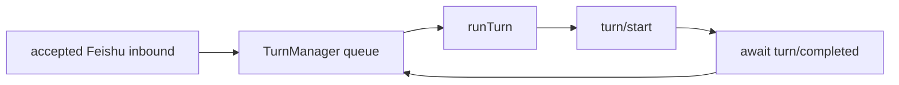
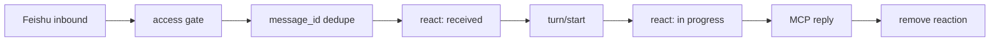

# Non-blocking dispatcher inbound

- **Status:** Implemented runtime contract for issue #63
- **Source:** https://github.com/excitedjs/dreamux/issues/63
- **Affects:** `/packages/dreamux/src/dispatcher/turn-manager.ts`, `/packages/dreamux/src/dispatcher/runtime.ts`, `/packages/dreamux/src/codex/events.ts`, `/packages/dreamux/src/server.ts`, `/packages/dreamux/tests/fake-codex.ts`, `/packages/dreamux/tests/codex-live.test.ts`

## Locked Scope

The dispatcher teammate mechanism stays synchronous. There is no trigger-turn,
mailbox wakeup, teammate-completion callback, idle polling redesign, or early
turn completion in this issue. A dispatcher turn may stay open while the model
waits on `send`, `wait`, or `spawn --prompt`.

Issue #63 removes dreamux's application-level head-of-line queue. It does not
eliminate long turns and does not make folded input visible to the model until
the current synchronous operation returns and the ReAct loop advances.

Do not add a dreamux submission mutex. Do not add a production turn observer.
Do not call `turn/steer` for normal Feishu inbound. Do not maintain a local
`activeTurnId`. Do not aggregate messages until turn completion.

## Codex Contract

Codex `turn/start` is the authoritative aggregate user-input RPC:

- when a regular turn is active, `turn/start` folds the new input into that
  active turn's pending input;
- when the thread is idle, `turn/start` starts a new regular turn;
- dreamux does not need to decide active versus idle itself.

The source path is:

- app-server `turn/start` creates `Op::UserInput` and submits it to the core
  session;
- core `user_input_or_turn_inner` first calls `steer_input` with no
  `expectedTurnId`;
- if `steer_input` succeeds, the input is pending input for the active turn;
- only `NoActiveTurn` falls through to spawning a new regular turn.

This dissolves the v2 stale-state gap. Since dreamux never calls `turn/steer`
and never keeps an `activeTurnId`, there is no stale-id path that can produce
`NoActiveTurn` and drop an accepted message.

## Pre-Issue #63 Artifact

Before issue #63, the dispatcher inbound path was a process-local serialized
turn worker:

`TurnManager.drainLoop()` awaits `processBatch()`, and `processBatch()` awaits
`runTurn()`. `runTurn()` submits `turn/start` and resolves only after
`turn/completed`. A long Codex turn therefore blocks later accepted Feishu
messages from reaching Codex.

The channel added one `RECEIVED_REACTION_EMOJI` after
`DispatcherRuntime.enqueueInbound()` returned true. Issue #63 replaced this
with a three-state channel-owned reaction flow.

## Runtime Model

Every accepted, deduped inbound message submits exactly one `turn/start`.
dreamux never waits for `turn/completed` before accepting or submitting the next
inbound.

## Code Changes

`packages/dreamux/src/dispatcher/turn-manager.ts`

- Remove same-chat coalescing and the completion-gated `drainLoop()` /
  `processBatch()` queue as the inbound submission gate.
- Keep process-local `message_id` dedupe.
- Replace `enqueue(input): boolean` with an async per-message submission path:
  accepted, deduped input is formatted as one prompt/envelope and submitted via
  `turn/start` immediately.
- Return a delivery result to the runtime/server so the channel can switch the
  reaction to in-progress at the `turn/start` acceptance point.
- Do not track active turn ids. Do not call `turn/steer`.

`packages/dreamux/src/dispatcher/runtime.ts`

- Keep owning the Codex client and thread id.
- Replace the synchronous boolean `enqueueInbound()` result with an async
  delivery result from `TurnManager.enqueue()`, including duplicate/submitted
  information and submission errors.
- Do not introduce a mutex, observer, or active/idle branch.

`packages/dreamux/src/codex/events.ts`

- Split the current `runTurn()` shape so production inbound can call a
  `submitTurnStart()`-style helper that sends `turn/start` and resolves on the
  RPC acceptance ack.
- The old `runTurn()` shape (`turn/start` plus await `turn/completed`) must not
  remain on the Feishu inbound path. It can remain only as a test/diagnostic
  helper if still useful.
- Do not add a `turn/steer` helper for normal Feishu inbound.

`packages/dreamux/src/server.ts`

- In `Server.startDispatcher()`'s `bot.start(async event)` handler, add the
  received emoji immediately after the access gate passes and `message_id`
  dedupe reports a miss. Do not react to dropped messages or duplicate
  redeliveries.
- After `runtime.enqueueInbound()` reports `turn/start` acceptance, replace the
  received reaction with the in-progress emoji.
- In `replyFromMcp()`, keep clearing the channel-owned reaction for
  `input.messageId` after the model reply is sent.
- Replace the single `receivedReactions` map with a channel-owned inbound
  reaction ledger that stores the current reaction id and state per message id.
  Feishu reactions are replaced by removing the previous channel-owned reaction
  id and adding the new emoji.
- Keep `pendingReceivedReactionClears`: an MCP reply can still clear before an
  async add/replace reaction call finishes.

`packages/dreamux/src/channel/feishu-message.ts`

- Keep the existing discrete `<feishu_message>` envelope and routing metadata
  (`chat_id`, `message_id`, `sender_id`, `sender_name`, `create_time`) so the
  model can reply to the correct source message after interleaving.

## Reaction Contract

The channel-owned reaction has three visible states:

- Feishu channel receives the message, after access-pass and dedupe-miss: add
  `[received]`. "Immediately" means before Codex submission, not before
  access/dedupe.
- Codex accepts `turn/start`: replace with `[in progress]` immediately at
  submission acceptance, not at model consumption.
- The model replies through MCP `reply` for that `message_id`: remove the
  channel-owned reaction.

If `turn/start` rejects before Codex accepts the input, keep `[received]` and
log the submission failure. If Codex accepts the input and the later turn fails,
aborts, or is interrupted before a reply, a remaining `[in progress]` reaction
is accepted. Do not add an observer or extra state machine only to clean it up.

## Tests

Fake-Codex tests must cover:

- every accepted, deduped inbound calls `turn/start`;
- while a fake turn is active, a later `turn/start` is accepted and folds into
  that active fake turn rather than producing a second completed turn;
- no mutex/backlog waits for `turn/completed`;
- reaction path `[received] -> [in progress] -> removed`;
- clear-before-add still prevents a late async reaction add from resurrecting a
  cleared channel-owned reaction;
- no stale-`activeTurnId` / `NoActiveTurn` fallback test remains, because
  dreamux no longer calls `turn/steer`.

The live Codex integration gate must start a real Codex app-server, put the
dispatcher into a turn blocked on a short synchronous operation, inject a
Feishu inbound during that mid-turn window, and prove:

- dreamux submits the second inbound with `turn/start`;
- Codex folds that input into the current active turn rather than rejecting,
  queuing behind completion, or starting a parallel turn;
- the folded marker is processed after the synchronous operation returns and
  the ReAct loop advances;
- the reaction sequence for that inbound is `[received] -> [in progress] ->
  removed`.

This live gate is the load-bearing proof. Static review and fake tests are not
enough for issue #63.
