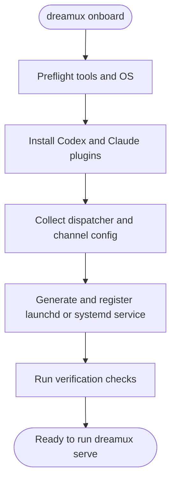

# Global `dreamux` bin, `onboard`, and `serve`

- **Status:** Active design
- **Date:** 2026-06-02
- **Issue:** [issue #18](https://github.com/excitedjs/dreamux/issues/18)
- **Related:** [cli-and-package-naming](../decisions/cli-and-package-naming.md), [global-config-dir](../decisions/global-config-dir.md), [global-bin-onboard-serve](../decisions/global-bin-onboard-serve.md)
- **Code facts checked:** `/packages/dreamux/package.json`, `/packages/dreamux/src/cli/dreamux.ts`, `/packages/dreamux/src/cli/server.ts`, `/packages/dreamux/src/cli/server-ctl.ts`, `/packages/dreamux/src/server.ts`, `/packages/dreamux/src/dispatcher/runtime.ts`, `/packages/dreamux/src/codex/supervisor.ts`, `/packages/dreamux/src/runtime/config.ts`, `/packages/dreamux/src/runtime/paths.ts`, `/packages/dreamux/src/runtime/codex-args.ts`

## User-facing outcome

Installing `@excitedjs/dreamux` globally exposes one global binary:
`dreamux`. That binary owns installation, onboarding, service registration,
local serving, diagnostics, and the existing dispatcher administration
surface.

There is no legacy compatibility period for globally installed bins. The
issue #18 implementation should publish the new single-bin shape directly:
`dreamux-server` and `server-ctl` are not installed as global aliases.

The canonical first-run path is:

```bash
dreamux onboard
dreamux serve
```

`dreamux onboard` moves an operator from "nothing configured" to "the
machine has the required Codex / Claude plugins, a registered service, and
at least one dispatcher/channel configuration." `dreamux serve` runs the
local server in the foreground; service managers invoke that same command.

## Current code anchor

- `/packages/dreamux/package.json` currently publishes three bins:
  `dreamux`, `dreamux-server`, and `server-ctl`.
- `/packages/dreamux/src/cli/dreamux.ts` is a hand-written router for
  `dreamux server start`, `dreamux server status`, and
  `dreamux dispatcher ...`.
- `/packages/dreamux/src/server.ts` already starts every enabled
  dispatcher when the server starts.
- `/packages/dreamux/src/dispatcher/runtime.ts` already owns one long-lived
  Codex `app-server` child per dispatcher.
- `/packages/dreamux/src/codex/supervisor.ts` currently starts Codex with
  `codex app-server --listen unix://<socket>`.

Issue #18 changes the published CLI shape and adds onboarding / user-level
service registration. It should reuse the existing server and dispatcher
seams rather than create a second runtime.

## Command surface

Canonical commands:

```bash
dreamux onboard
dreamux serve
dreamux status
dreamux doctor
dreamux dispatcher add
dreamux dispatcher remove
dreamux dispatcher list
dreamux dispatcher status
dreamux dispatcher start
dreamux dispatcher stop
dreamux config path
dreamux config show
```

Introspection command scope:

- `dreamux status`: short operator summary for the running local service,
  combining admin-socket reachability, server pid / uptime, and dispatcher
  readiness.
- `dreamux doctor`: diagnostic preflight for installation health, tool
  versions, config parse errors, service registration, plugin presence,
  runtime dir permissions, and Codex app-server capability.
- `dreamux dispatcher status --id <id>`: one dispatcher's admin-state view:
  bot/channel identity, enabled flag, runtime status, thread id, last error,
  and inbound/outbound backlog.

Old command forms from the current MVP:

```bash
dreamux server start
dreamux server status
```

`dreamux serve` replaces `dreamux server start`. Because there are no
existing global-bin users to protect, the implementation does not preserve
these old command forms as compatibility contracts. They may exist
temporarily during refactoring, but new docs, tests, service units, and the
published package should target the new command tree directly.

## Onboard flow



### Preflight

`dreamux onboard` should check and report:

- Node version satisfies `/packages/dreamux/package.json`.
- `dreamux` resolves to the installed package entry point.
- `codex` exists and supports `codex plugin add`,
  `codex plugin marketplace add`, and `codex app-server --listen`.
- `claude` exists and supports `claude plugin marketplace add` and
  `claude plugin install`.
- Host OS is `darwin` or Linux.
- The selected service manager is available:
  `launchctl` on macOS, `systemctl --user` on Linux.
- The chosen config directory is writable.
- The chosen runtime directory is writable.
- The dispatcher private Codex home root is writable.

The command should support `--dry-run`, `--yes`, and non-TTY execution.
In non-TTY mode every required value must come from flags, env, or existing
config; missing values fail loudly.

### Plugin installation

The onboarding command installs two plugin surfaces:

- Codex: install the `codexmux` plugin into the dispatcher app-server's
  private `CODEX_HOME`.
- Claude: install the `claudemux` plugin for Claude Code so the plugin
  hooks that anchor teammate state are available to `tm`-driven sessions.

The `codexmux` consumer is the dispatcher agent, not the `tm` teammates.
The `codexmux-dispatcher` skill is scoped to the dispatcher agent, and the
dispatcher is the long-lived Codex app-server launched by `dreamux serve`.
Codex loads plugins from the `CODEX_HOME` used by that app-server, so
`codexmux` must be installed into the dispatcher app-server's private
`CODEX_HOME`.

Plugin installation location and app-server control state are separate
concerns, but they intentionally use the same dispatcher-private Codex home:

- plugin and marketplace config live under `<CODEX_HOME>/config.toml`
  and plugin files under `<CODEX_HOME>/plugins/`
- app-server control sockets live under
  `<CODEX_HOME>/app-server-control/`

Do not install `codexmux` into the operator's default global Codex home for
issue #18. The daemon's high-risk dispatcher settings belong in the
dispatcher-private home, keeping the user's daily interactive Codex home on
its normal safe defaults.

Codex 0.135.0 treats `config.toml` as per-`CODEX_HOME` user config. A
private dispatcher `CODEX_HOME` does not inherit or include the operator's
default global Codex config. `dreamux onboard` must therefore generate a
minimal dispatcher-private `config.toml` instead of copying the entire
global config:

- the `codexmux` plugin and marketplace declaration
- the selected network-enabled runtime configuration, including the approval
  and sandbox settings needed for a persistent app-server. For Codex 0.135,
  permission-profile fallback uses `default_permissions` plus
  `[permissions.<name>] network = { enabled = true }`; `serve` must still
  validate the final effective values after `-c` CLI overrides.
- required model / provider settings when the operator does not accept the
  Codex defaults
- the chosen auth mode or auth preflight contract, without storing channel
  secrets in the config

`dreamux onboard` may read the operator's global Codex config only as input
for prompts. It must not copy the whole file and must not modify the global
Codex home as part of this design slice.

The command should be idempotent:

- Add / update the configured Codex marketplace source before installing
  `codexmux`.
- Run the Codex plugin commands with `CODEX_HOME` set to the dispatcher
  private Codex home.
- Add / update the configured Claude marketplace source before installing
  `claudemux`.
- Re-check installed plugin state after each install.
- Prefer structured CLI output when available. Claude Code exposes
  `claude plugin list --json`; Codex 0.135.0's `codex plugin list` help
  does not advertise JSON output, so the implementation must not depend on
  JSON there until a newer Codex version confirms it.

Open default inputs:

| Value | Default direction |
|---|---|
| Codex marketplace source | Public `excitedjs/dreamux` with sparse paths `.agents/plugins` and `codex-marketplace/plugins/codexmux` |
| Codex plugin selector | `codexmux@dreamux` |
| Claude marketplace source | Public `excitedjs/claudemux` |
| Claude plugin selector | `claudemux@claudemux` |
| Claude install scope | `user` |

Do not commit concrete private identifiers, local user paths, internal
hostnames, registry URLs, or secrets into the repo.

### Write transparency

`dreamux onboard` must print every file path it creates or modifies during
installation. The operator should be able to see exactly which machine
state changed.

Rules:

- Maintain a path ledger for each onboarding step.
- Print the path before writing when dreamux itself owns the write.
- Print the path after writing with `created`, `modified`, or `unchanged`.
- Include paths written by subprocesses such as `codex plugin ...`,
  `claude plugin ...`, `launchctl`, and `systemctl` when those writes are
  part of onboarding.
- If a subprocess cannot expose the exact files it may modify, run it under
  an explicit home/config directory that makes the path set known, or treat
  the missing path disclosure as a preflight failure.
- Redact secret values, but do not hide file paths.

Known path classes that onboard should disclose:

| Step | Path class |
|---|---|
| Global config | `~/.dreamux/config.toml` or the selected config file |
| Runtime state | `<runtime_dir>/state.db` and migration side effects |
| Dispatcher Codex home | `<CODEX_HOME>/config.toml`, `<CODEX_HOME>/plugins/`, `<CODEX_HOME>/app-server-control/`, and auth-state paths used by the dispatcher app-server |
| Claude plugin install | the Claude Code marketplace / plugin files under the selected Claude scope |
| macOS service | `~/Library/LaunchAgents/dev.excited.dreamux.plist` |
| Linux service | `~/.config/systemd/user/dreamux.service` |
| Logs | service stdout / stderr log paths under the selected runtime log directory |

### Interactive guide

Use an interactive wizard only for values an operator actually needs to
decide. The guide collects:

- Config directory, defaulting to `~/.dreamux`.
- Runtime directory, defaulting to `~/.codex-host`.
- Codex binary path; store an absolute path when discovered.
- Dispatcher id.
- Dispatcher private Codex home, defaulting under the dispatcher runtime
  directory.
- Dispatcher directory / Codex working root for the long-lived
  app-server.
- Dispatcher Codex model / provider selection when the operator does not
  want Codex defaults.
- Dispatcher Codex auth mode, or the external auth environment contract
  that `dreamux serve` must validate.
- Channel type. The first supported channel is the existing Feishu bot
  channel.
- Channel app identifier.
- Secret reference, not the secret value. The existing `env:<VAR>` shape
  remains the default.
- Whether to register a service now.
- Whether to start the service now.

The wizard should not store channel secrets directly. It may validate that
an env var exists when the secret reference uses `env:<VAR>`, but absence
should be reported as a fixable preflight failure rather than written into
config.

For the first issue #18 implementation, keep the existing source of truth
for dispatcher registration: use the admin / repository surface that backs
`dreamux dispatcher add`. Do not add a second dispatcher config file unless
there is a separate decision to migrate dispatcher definitions out of
SQLite.

## Serve behavior

`dreamux serve` runs the local server in the foreground:

- Load or initialize `~/.dreamux/config.toml`.
- Open the runtime directory and SQLite database.
- Open the admin Unix socket.
- Start every enabled dispatcher.
- For each dispatcher, validate the dispatcher-private Codex home before
  starting the app-server: config parse succeeds, `codexmux` is installed
  in that home, the effective Codex runtime config after `-c` CLI overrides
  is network-enabled, the control socket path is not under `/tmp` and fits
  Unix socket path limits, and the selected model / auth contract is usable.
- For each dispatcher, start one long-lived Codex `app-server` child with
  `CODEX_HOME` set to that dispatcher-private Codex home.
- Keep running until SIGTERM / SIGINT, then drain dispatchers and close
  the admin socket.

Service managers should run `dreamux serve`; `serve` should not daemonize
itself.

### Dispatcher app-server runtime requirements

The dispatcher is a persistent Codex `app-server`. Production `serve`
must start it in a profile that can bind/listen and can write its runtime
Codex home / control directory.

Required constraints:

- Do not run the dispatcher app-server under Codex's restricted-network
  workspace profile.
- Use a non-restricted profile, or at minimum a network-enabled permission
  profile, so bind/listen is not blocked.
- Set a private, dreamux-managed runtime `CODEX_HOME` for every dispatcher
  app-server.
- Install and enable `codexmux` in that same private `CODEX_HOME`, because
  the dispatcher app-server loads its plugins and skills from the home it
  runs under.
- Generate a minimal `<CODEX_HOME>/config.toml`; do not rely on inheritance
  from the operator's default global Codex home.
- Place app-server control sockets under
  `<CODEX_HOME>/app-server-control/`.
- Use a short fixed socket leaf under that directory, and fail preflight when
  the UTF-8 socket path exceeds the conservative macOS-safe Unix socket
  limit of 103 bytes.
- Do not place control sockets in `/tmp`.
- Create the private `CODEX_HOME` with owner-only permissions. The
  `app-server-control/` directory is runtime-owned ephemeral state; `serve`
  creates it before spawning Codex and the doctor must not require it to
  pre-exist.

Suggested layout:

| Path | Owner | Purpose |
|---|---|---|
| `<runtime_dir>/dispatchers/<id>/codex-home/` | dreamux | Runtime, config, and plugin `CODEX_HOME` for this dispatcher app-server |
| `<runtime_dir>/dispatchers/<id>/codex-home/config.toml` | dreamux | Minimal dispatcher Codex config: `codexmux`, network-enabled permissions, model/provider defaults, and auth contract |
| `<runtime_dir>/dispatchers/<id>/codex-home/plugins/` | Codex | Installed `codexmux` plugin cache and skill files |
| `<runtime_dir>/dispatchers/<id>/codex-home/app-server-control/` | dreamux | Runtime-created Codex app-server control socket directory; current socket leaf is `as.sock` |
| `<runtime_dir>/dispatchers/<id>/cwd/` | dreamux | App-server cwd, intentionally not a worktree |
| `<runtime_dir>/dispatchers/<id>/stdout.log` | dreamux | Codex stdout |
| `<runtime_dir>/dispatchers/<id>/stderr.log` | dreamux | Codex stderr |

This updates the current `/packages/dreamux/src/runtime/paths.ts`
contract, which currently places dispatcher sockets directly under the
dispatcher runtime directory.

Implementation must include an explicit migration / compatibility note for
existing runtime state. The app-server control socket can move because it is
ephemeral process state, but the implementation must not delete dispatcher
SQLite rows, thread ids, cwd directories, or logs. On first start after the
layout change, `serve` should stop any stale process using the old flat
socket path, create the private Codex home and runtime control directory,
and write future control state under `<CODEX_HOME>/app-server-control/`.

## Service registration

Onboard registers with the native service manager. The generated service
runs the foreground command:

```bash
dreamux serve
```

Use argv arrays and native unit files, not shell strings.

The first implementation only supports user-level services. It must not
install root-scoped macOS LaunchDaemons or root-scoped systemd services.

`dreamux onboard` owns first-time service creation directly. Re-run semantics
must be idempotent: if the generated service file already matches the desired
content, report it as `unchanged`; if the desired content differs, report
`modified` and reload/restart through the native service manager.

There is no public `dreamux daemon ...` command tree in issue #18. A user-level
service that runs foreground `dreamux serve` is the daemon shape. After
onboarding, operators use the native service manager directly for ongoing
start / stop / status / uninstall operations.

The package launcher resolves its own symlink chain and passes the resolved
absolute launcher path to the TypeScript CLI via `DREAMUX_BIN`; service unit
generation uses that value unless the operator supplies `--dreamux-bin`.

### macOS launchd

Default to a user LaunchAgent:

- Plist path: `~/Library/LaunchAgents/dev.excited.dreamux.plist`.
- Label: `dev.excited.dreamux`.
- `ProgramArguments`: absolute `dreamux` path plus `serve`.
- `RunAtLoad`: true.
- `KeepAlive`: true.
- `StandardOutPath` and `StandardErrorPath`: under the runtime log
  directory.
- Register via `launchctl bootstrap gui/<uid> <plist>`.
- Start / restart via `launchctl kickstart -k gui/<uid>/dev.excited.dreamux`.
- Stop via `launchctl bootout gui/<uid>/dev.excited.dreamux`.

Root LaunchDaemons are out of scope for issue #18.

### Linux systemd

Default to a user service:

- Unit path: `~/.config/systemd/user/dreamux.service`.
- `[Service] Type=simple`.
- `ExecStart`: absolute `dreamux` path plus `serve`.
- `Restart=on-failure`.
- `RestartSec=2s`.
- `WorkingDirectory`: the configured runtime directory.
- `Environment`: only non-secret paths needed by dreamux.
- `[Install] WantedBy=default.target`.
- Register via `systemctl --user daemon-reload`.
- Enable and start via `systemctl --user enable --now dreamux.service`.
- Stop via `systemctl --user stop dreamux.service`.
- Uninstall via `systemctl --user disable --now dreamux.service`, remove
  the unit, then `systemctl --user daemon-reload`.

`loginctl enable-linger` is out of scope for the first implementation
because it may require privileges and changes user-session boot behavior.

## Commodity packages

Use established packages for commodity infrastructure:

| Concern | Choice | Reason |
|---|---|---|
| CLI parsing and help | `yargs` | Mature command tree, strict option validation, generated help, async handlers, no hand-written argv parser. |
| Interactive onboarding | `@clack/prompts` | Small, focused, good for finite first-run prompts, script-friendly cancellation. |
| Process execution | `execa` | Runs argv arrays without shell interpolation, better errors, timeouts, stdout capture. |
| launchd plist generation | `plist` | Avoid hand-written XML and escaping bugs. |
| Config parsing | existing `smol-toml` | Already used in `/packages/dreamux/src/runtime/config.ts`; keep one TOML parser. |

Alternatives:

- `inquirer` is mature and acceptable, but it is broader than this finite
  onboarding wizard needs.
- `ink` is a React terminal renderer for richer full-screen apps; it is
  overkill for `dreamux onboard` and would add unnecessary rendering
  complexity.
- Hand-written CLI parsing and prompt rendering are rejected by issue #18's
  "no homegrown commodity infra" constraint.

## Settled product decisions

- No legacy global bins: publish only `dreamux`; do not install
  `dreamux-server` or `server-ctl`.
- Codex plugin installation targets the dispatcher app-server's private
  `CODEX_HOME`, not the operator's default global Codex home.
- Service registration is user-level only: macOS LaunchAgent and
  `systemd --user`.
- Marketplace defaults for the first implementation are
  `excitedjs/dreamux --sparse .agents/plugins --sparse codex-marketplace/plugins/codexmux`
  plus `codexmux@dreamux` for Codex, and `excitedjs/claudemux` plus
  `claudemux@claudemux` for Claude.
