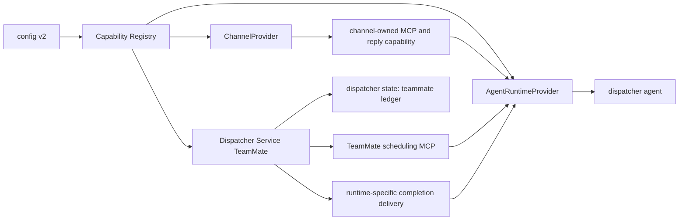

# Plugin and provider architecture

- **Status:** Historical issue #110 proposal; implemented Phase 1 boundaries
  are refined by
  [provider-architecture-realignment](../decisions/provider-architecture-realignment.md)
- **Date:** 2026-06-06
- **Affects:** plugin mechanism, Capability Registry, dispatcher config,
  Channel providers, Agent Runtime providers, MCP injection, server-hosted
  TeamMate, dispatcher state
- **Source:** [issue #110](https://github.com/excitedjs/dreamux/issues/110),
  refined from [issue #71](https://github.com/excitedjs/dreamux/issues/71)
  and the compatibility stance in
  [issue #98](https://github.com/excitedjs/dreamux/issues/98)

## Context

The current runtime is intentionally narrow: one dispatcher owns one Feishu
channel, one Codex app-server child, one Codex thread, and one dispatcher-scoped
Feishu MCP shim. That MVP boundary is documented in
[top-level-design](../decisions/top-level-design.md).

Issue #110 changes the target architecture. Dreamux needs a full extension
surface that covers:

- a plugin/provider reference model;
- an in-process Capability Registry;
- Channel providers;
- Agent Runtime providers;
- server-hosted TeamMate scheduling, task state, delivery, and result
  retrieval.

Issue #135 later narrows the current provider seam: Feishu is a built-in
bidirectional channel rather than a runnable ChannelProvider, and the registry
is an Agent Runtime provider view. Read
[provider-architecture-realignment](../decisions/provider-architecture-realignment.md)
before treating this proposal as current implementation guidance.

The architecture must preserve public safety and the issue #98 compatibility
policy: incompatible 0.x config or state changes fail loudly, require explicit
rebuild/migration, or rebuild only server-owned disposable state with an
operator-visible warning.

## Goals

- Make Dreamux core the control plane: config parsing, provider resolution,
  capability registration, dispatcher state ownership, TeamMate task ownership,
  and MCP injection orchestration.
- Make providers own execution details: channel lifecycle and reply behavior,
  runtime launch/resume/delivery behavior, and provider-local configuration.
- Keep Phase 1 limited to builtin providers while reserving npm package/export
  references in schema and manifest design.
- Support `builtin:feishu`, `builtin:codex`, and `builtin:claude-code` as the
  initial builtin provider refs.
- Treat Claude Code as part of the Epic, not as an optional follow-up. An Agent
  Runtime abstraction that cannot express Claude Code completion delivery is not
  complete for issue #110.
- Move TeamMate orchestration into Dispatcher Service ownership without allowing
  TeamMates to recursively dispatch TeamMates.

## Non-goals

- No npm provider loading, installing, updating, or executing in Phase 1.
- No external plugin marketplace.
- No silent migration of existing 0.x config or authorization state.
- No movement of user-configured MCP servers into Dreamux core. Dreamux injects
  only Channel provider MCP and Dispatcher Service TeamMate scheduling MCP.
- No change to Codex global auth, config, or memory ownership unless a later
  decision explicitly supersedes that boundary.

## Architecture

Dreamux core stays small and explicit: it wires providers together, owns server
state, and exposes only the Dreamux-provided MCP surfaces.



The control-plane boundary is:

- config v2 declares dispatchers, channels, runtime provider, and provider
  config;
- provider refs are normalized before use;
- the registry resolves builtin providers and exposes capability descriptors;
- Dispatcher Service owns TeamMate task acceptance, state, retry, result
  retention, and retrieval;
- Agent Runtime providers receive Dreamux MCP descriptors and decide how to
  inject them into their runtime.

## Provider references and registry

Provider refs use public, explicit identifiers:

- `builtin:<id>` for bundled providers such as `builtin:feishu`;
- npm package refs and package export refs reserved for future external
  providers.

Phase 1 may parse and validate external refs as reserved syntax, but must not
load or execute them. Startup should fail clearly if a dispatcher tries to run a
non-builtin provider before external loading is implemented.

The Capability Registry is process-local. It records provider descriptors and
the capabilities they expose. It is not a marketplace and does not install
packages.

## Channel providers

A Channel provider owns:

- channel lifecycle;
- provider-specific access semantics;
- inbound event normalization into dispatcher context envelopes;
- channel-owned MCP server descriptors;
- reply and reaction capabilities when the provider exposes them.

Dreamux core must not classify channels as one-way or two-way. Reply exists if
the provider exposes a reply capability. This keeps the current Feishu channel
compatible while allowing future subscription-style channels that do not share
Feishu access semantics.

The current `1 dispatcher : 1 Feishu channel` assumption is no longer a target
architecture invariant. Phase 1 may still run one Feishu channel per dispatcher
while the provider interface and config shape use `channels[]`.

## Agent Runtime providers

An Agent Runtime provider owns:

- runtime start, resume, stop, and health;
- Dreamux MCP injection;
- inbound turn submission;
- runtime-specific TeamMate completion delivery.

The interface must cover both confirmed builtin runtimes:

- Codex completion delivery: inbox plus turn trigger;
- Claude Code completion delivery: task notification path.

The interface must be shaped for both delivery styles before the Codex adapter
lands, so `builtin:codex` does not accidentally become the hidden shape of the
whole abstraction.

## Server-hosted TeamMate

Dispatcher Service owns TeamMate task state. The scheduling MCP accepts work and
returns immediately with an accepted task id. The task later completes through
runtime-specific delivery. If push delivery fails repeatedly, the final result
remains available through a retrieval surface.

The default ledger lives under the existing Dreamux dispatcher state layout:

```text
~/.dreamux/state/<dispatcher-id>/teammate/
```

TeamMates cannot nested-dispatch TeamMates. Future TeamMate-to-TeamMate
communication, if needed, must be routed by Dispatcher Service rather than by
the dispatcher agent recursively scheduling more TeamMates.

History/result retrieval can be named differently from `history` or `last`, but
it must cover:

- listing recent tasks;
- fetching a specific task result;
- fetching the latest relevant final result;
- reading the result after push delivery fails.

Completion delivery should align with the per-dispatcher state owner before the
delivery implementation lands. It should not bind to transient turn-manager
state that is expected to be replaced by a dispatcher-scoped owner.

## Config shape

Config v2 is providerized. The concrete schema can evolve in implementation,
but the durable shape is:

```json
{
  "dispatchers": [
    {
      "id": "dispatcher-a",
      "cwd": "/path/to/workspace",
      "enabled": true,
      "channels": [
        {
          "id": "primary",
          "provider": "builtin:feishu",
          "config": {}
        }
      ],
      "runtime": {
        "provider": "builtin:codex",
        "config": {}
      }
    }
  ]
}
```

Provider config objects are provider-owned. Dreamux core validates only the
common envelope and delegates provider-local validation to the provider
descriptor.

External npm refs may appear in the schema and manifest model as reserved refs,
but Phase 1 rejects them as non-runnable.

## State and restart semantics

State remains server-owned and separate from operator config. The TeamMate
ledger is per-dispatcher state, versioned, and recoverable through Dispatcher
Service.

Restart recovery must preserve the distinction from issue #98:

- authorization and other sensitive state must fail loudly when incompatible;
- rebuildable process state may warn and rebuild or drop only when the loss is
  explicit and safe;
- TeamMate final outputs must not be silently discarded merely because push
  delivery failed.

## Security and permissions

- Provider config that contains secrets remains in owner-only operator config
  and must be redacted from status, doctor, config display, and logs.
- Channel access semantics are provider-owned; core must not copy Feishu-specific
  rules into the generic channel abstraction.
- Channel MCP runs through Dreamux's dispatcher-scoped admin boundary.
- TeamMate scheduling is a Dispatcher Service capability. TeamMate processes do
  not receive authority to schedule more TeamMates.
- Codex global auth, config, and memory stay under Codex ownership. Dreamux must
  not create dispatcher-private Codex homes for this Epic.

## Decision records

The proposal is made concrete by these issue #110 decisions:

- [provider references and Capability Registry](../decisions/provider-references-and-capability-registry.md)
- [Agent Runtime providers](../decisions/agent-runtime-provider.md)
- [Channel providers](../decisions/channel-provider.md)
- [server-hosted TeamMate](../decisions/server-hosted-teammate.md)
- [providerized config and state compatibility](../decisions/providerized-config-state-compatibility.md)
