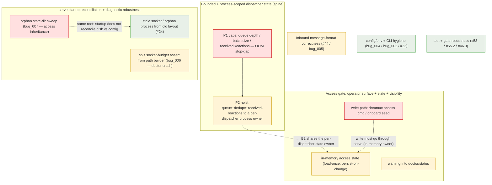

# Post-MVP hardening: bounded state, restart reconciliation, access surface

- **Status:** Proposed
- **Date:** 2026-06-04
- **Affects:** dispatcher runtime, turn queue, Feishu access gate, server
  startup, message formatting, CLI/admin surface, diagnostics
- **Source:** consolidates the deferred non-blocking findings from the
  issue #36 epic review (#42, #44, #46, #49, #53, #55) plus pre-existing
  #22 / #24, and the ultracode review of #58 (bug_001–bug_007). Excludes
  #6 (blocked on the public npm publish of the shared feishu-transport core).

## Context

The issue #36 epic merged with a known set of non-blocking follow-ups, and an
ultracode review of #58 surfaced more. Read by root cause rather than by issue,
~two-thirds reduce to one question: **where does each dispatcher's in-memory
runtime state live, is it bounded, and does it survive a Codex child restart and
a config-driven dispatcher removal?** The rest are independent: message-format
correctness, config/env + CLI hygiene, and test/gate robustness.

The ultracode review corroborated three already-known items (unbounded
`receivedReactions` = #55.1, per-event `access.json` rewrite = #42.2, mention
prefix collision = #44.1) and added three genuinely new ones: a diagnostic-path
crash (bug_006), a silent access-control regression on dispatcher re-add
(bug_007), and a silent `CODEX_HOME` strip (bug_004).

## Bounded and process-scoped dispatcher state

**Root cause.** Per-dispatcher in-memory structures live inside `TurnManager`
and have no caps. `/packages/dreamux/src/dispatcher/turn-manager.ts` holds an
uncapped `queue: TurnBatch[]`, an uncapped per-chat `messages` array, and a
`batchPrompt` that joins all of them; its `seenMessageIds` dedupe is capped
(1024) but is *TurnManager-local*. `/packages/dreamux/src/server.ts` keeps a
`receivedReactions` Map that is only deleted on a `reply` matching the
message_id (`pendingReceivedReactionClears` is capped, `receivedReactions` is
not). Because `TurnManager` is destroyed and recreated on every Codex child
restart, the queue and dedupe are lost/reset on restart.

**Consequence.** Unbounded growth → OOM and Codex context blow-out under a
slow/stuck turn plus high inbound (#46.1, amplified by D5); a slow
`receivedReactions` leak (#55.1 / bug_001). Restart loses queued + in-flight
inbound, expands the dangling-reaction limitation to every child crash, and
resets dedupe so a redelivery straddling a restart double-processes
(#49.1/#49.2/#49.5).

**Fix.**
- **P1 (cheap, urgent):** cap batch size + total queue depth (drop-oldest +
  log) in `/packages/dreamux/src/dispatcher/turn-manager.ts`; cap/TTL
  `receivedReactions` in `/packages/dreamux/src/server.ts` (reuse the existing
  `pendingReceivedReactionClears` LRU shape); decide whether a coalesced-batch
  reply clears *all* batched message_ids, not only the latest.
- **P2 (architectural):** hoist queue + dedupe + received-reaction state out of
  `TurnManager` into a per-dispatcher process-scoped owner in
  `/packages/dreamux/src/dispatcher/runtime.ts` (or a new
  `/packages/dreamux/src/dispatcher/inbound-state.ts`); `TurnManager` becomes a
  pure executor that reattaches to the persistent owner across a child restart.
  In-memory only (not on disk) — honours D4=B (no persisted reaction ledger)
  while fixing the child-restart window; add a transient busy/degraded reaction
  during the window so inbound is not silently ghosted.
- **Adjacent one-liners in `/packages/dreamux/src/dispatcher/runtime.ts`:**
  `if (this.stopping) return` at the top of the restart `catch` (#49.3); a
  give-up threshold / log throttle for permanent restart failure (#49.4).

**Value.** P1 = high (only path to OOM). P2 = medium.
**Order/deps.** P1 first (stop the bleed); P2 builds on P1 and absorbs the
access-state ownership of theme B.
**Risk.** P2 touches the concurrency hot path verified across the epic (serial
turn, reaction pending-clear race, dedupe atomicity). The refactor must preserve
those invariants and land with regression tests for them.

## Access gate: operator surface, state ownership, visibility

**Root cause.** `/packages/dreamux/src/channel/feishu-gate.ts`
`loadDispatcherAccess` / `saveDispatcherAccess` are raw file I/O, and
`/packages/dreamux/src/server.ts` calls both on *every* inbound event (because
`last_gate` mutates each time). The Task 11 schema removed `dispatchers[].access`
(it is rejected), and nothing seeds `access.json` — no onboard write, no admin
command.

**Consequence.**
- **No operator write path (#42.1):** default `dm.allow_users` is empty, so all
  DMs are dropped; only group + @mention works out of the box, and there is no
  documented way to enable a DM. **High** — a functional gap.
- **Per-event reload + rewrite (#42.2 / bug_003 / #42.4):** disk read+write on
  every inbound including drops (the common case); concurrent inbound can lose
  `observed_chats` / warning-dedup writes. Telemetry-only, but real write
  amplification.
- **Warning not surfaced (#42.5):** `/packages/dreamux/src/cli/doctor.ts` and
  the `server.status` handler in `/packages/dreamux/src/admin/methods.ts` do not
  read `access.json` warnings, so the trust-domain warning (and D1's limitation)
  is invisible.
- `require_mention` is dispatcher-global, not per-chat (#42.3) — design-accepted,
  defer.

**Fix.**
- Write path: add admin methods (`access.show/allow/block`) in
  `/packages/dreamux/src/admin/methods.ts` + a `dreamux access ...` verb in
  `/packages/dreamux/src/cli/dreamux.ts`, both mutating through serve (in-memory
  + persist); seed the operator into `dm.allow_users` during onboard in
  `/packages/dreamux/src/onboard/run.ts`. The write path must go through serve,
  not write the file behind a running serve's back.
- State ownership: fold access state into theme A's per-dispatcher owner
  (load-once at start, persist-on-change); make `last_gate` in-memory or
  throttled.
- Visibility: render `access.json` warnings in doctor and `server.status`.

**Value.** #42.1 = high; #42.5 / #42.2 = medium; #42.3 = low.
**Order/deps.** Write path + visibility can start independently; the "through
serve" write and the in-memory state are best done with theme A's P2 to avoid
disk/memory drift.
**Risk.** The access command must only mutate allowlists and route by
`dispatcher_id` over the 0600 admin socket (no new exposure beyond the existing
admin trust boundary).

## serve startup reconciliation and diagnostic robustness

**Root cause.** `dreamux serve` startup never reconciles on-disk state against
`config.dispatchers`. `/packages/dreamux/src/cli/server.ts` only `mkdirSync`s
the roots; `/packages/dreamux/src/runtime/dispatcher-store.ts` builds rows from
`config.dispatchers` only and `rowFromConfig` rehydrates `status.json` /
`access.json` by id alone; `/packages/dreamux/src/codex/supervisor.ts` only
removes the dispatcher's own new socket.

**Consequence.**
- **bug_007 (high — silent re-authorization):** removing a dispatcher from
  config (the only supported removal, since admin `dispatcher.remove` returns
  `UNSUPPORTED`) leaves `state/<id>/`. Re-adding the same id — possibly for a
  different Feishu app — silently inherits the old `access.json` allowlists and
  `observed_chats`. The `status.json` thread-id half is benign (`recordLostThread`
  handles a failed resume); the **access half is a silent access-control
  regression** with no log / warning / doctor signal.
- **bug_006 (normal — diagnostics crash):** Task 1 made
  `adminSocketPath()` / `dispatcherSocketPath()` in
  `/packages/dreamux/src/runtime/paths.ts` throw on a >103-byte path. But
  `/packages/dreamux/src/runtime/dispatcher-codex-home.ts`
  `dispatcherCodexHomeDoctorContext` calls `dispatcherSocketPath(id)` while
  merely *building* the context, and `/packages/dreamux/src/cli/doctor.ts`
  `readDispatchers` maps over `config.dispatchers` with no try/catch — so one
  over-budget dispatcher (a 64-char id, allowed by `validateDispatcherId`, under
  a normal HOME can exceed 103 bytes) crashes the whole `dreamux doctor`, and
  the graceful `unixSocketPathFitsBudget` check inside
  `validateDispatcherCodexHome` becomes unreachable.
- **#24 (low — upgrade-only):** a stale socket / orphaned dispatcher process
  from the pre-epic layout lingers after upgrade (paths differ, so no
  collision; the orphan process is a one-time resource leak).

**Fix.**
- Sweep orphans at `serve` startup: enumerate `readdirSync(stateRoot())` in
  `/packages/dreamux/src/server.ts` (or `dispatcher-store.ts`), compare against
  declared ids, and warn-and-isolate (move to `state/.orphan/<id>-<ts>/`) rather
  than silently inheriting. Optionally persist `bot_app_id` in `status.json` and
  refuse to rehydrate on mismatch — but sweeping covers both `status.json` and
  `access.json`, which the `bot_app_id` guard alone does not.
- Move the socket-budget assert out of the path builders in
  `/packages/dreamux/src/runtime/paths.ts` and into the bind/spawn sites; keep
  the `unixSocketPathFitsBudget` predicate at the diagnostic sites
  (`dispatcher-codex-home.ts`, `doctor.ts`) so doctor enumerates all dispatchers
  and reports the over-budget one as an error.
- In the same startup hook, clean stale old-layout sockets and terminate orphan
  old-layout dispatcher processes (reuse `isProcessAlive` in
  `/packages/dreamux/src/codex/supervisor.ts`, with a guard so only identifiable
  dispatcher processes are killed).

**Value.** bug_007 = high (silent re-auth); bug_006 = medium-high (the
diagnostic tool dies exactly when needed); #24 = low.
**Order/deps.** bug_006 is small and independent — do early. bug_007 + #24 share
the startup-reconciliation hook.
**Risk.** Orphan-process termination must not kill unrelated processes; orphan
state sweep should isolate, not delete, unless explicitly flagged.

## Inbound message-format correctness

**Root cause.** In `/packages/dreamux/src/channel/feishu-message.ts`,
`renderTextWithMentions` uses `out.split(mention.key).join(...)` in array order
with no longest-first ordering; `escapeXmlAttribute` does not strip
newlines/control chars; `formatFeishuCreateTime` passes through garbage but
normalizes empty to `""`.

**Consequence.**
- **#44.1 / bug_005 (real, deterministic at ≥10 mentions):** `@_user_1` is a
  prefix of `@_user_10`/`@_user_11`, so substituting `@_user_1` first corrupts
  `@_user_11` (wrong open_id/name + a stray `0`). Codex then sees the wrong
  mention target; a later `reply` `mention_user_ids` could @ the wrong person.
- #44.2 attr newline hardening (latent until a `sender_name` enricher lands);
  #44.4 garbage `create_time` inconsistency.

**Fix.** Sort mentions by key length descending (or single-pass
`/@_user_(\d+)/g` lookup); strip/escape newlines + control chars in attribute
values; normalize garbage `create_time` to `""`; add the missing tests in
`/packages/dreamux/tests/feishu-message.test.ts` (≥10 mentions, no-name
fallback, non-text type, create_time edges — #44.3).

**Value.** #44.1 = medium (real bug, low frequency); rest = low. Self-contained.
**Risk.** Low (pure functions; the injection axis already has strong tests).

## config/env and CLI hygiene

**Root cause + fix.**
- **bug_004 (nit):** `/packages/dreamux/src/runtime/package-bin.ts`
  `dispatcherProcessEnv` deletes `CODEX_HOME` after merging `extra_env`, so an
  operator's `extra_env.CODEX_HOME` is silently dropped. The strip is the
  correct invariant; only the silence is wrong. Reject the `CODEX_HOME` key in
  `extra_env` at config load in `/packages/dreamux/src/runtime/config.ts`
  (`readDispatcherCodex`), pointing at the design constraint.
- **bug_002 (nit):** `/packages/dreamux/src/cli/dreamux.ts` still registers
  `dispatcher add` / `remove` with full option parsing, but
  `/packages/dreamux/src/admin/methods.ts` returns `UNSUPPORTED`. Remove the
  dead CLI subcommands + `server-ctl` help + admin placeholders so yargs rejects
  immediately.
- **#22 (low-medium):** `dreamux serve --help` does not delegate to the rich
  help, and that help in `/packages/dreamux/src/cli/server.ts` is itself stale
  post-Task-11 (still mentions `runtime_dir`-era "Runtime data"). Route serve
  `--help` to a refreshed delegated help, or replace with equivalent yargs help.

**Value.** all low (cleanup / doc).

## test and gate robustness

**Root cause + fix.** Test debt and gate brittleness with no functional impact:
- #53: `/packages/dreamux/tests/codex-live.test.ts` MCP gate sends a single
  `mcpServerStatus/list` (flaky if Codex starts MCP servers more lazily — add a
  poll-until-tools-appear within the 30s budget); assert the server `status`
  field; document the `SUPPORTED_MCP_PROTOCOL_VERSIONS` maintenance coupling;
  fix the `/CLAUDE.md` reference to `tests/codex-0135-live.test.ts` (now
  `tests/codex-live.test.ts`).
- #55.2: add a serve-side outbound failure-path test (`setSendError` /
  `setReactionError` → `mcp.reply` / `mcp.react` → `OUTBOUND_FAILED` /
  `REACTION_FAILED`).
- #46.3: stuck-turn-blocks-queue and cross-chat non-starvation tests.

**Value.** low (hardening / debt). New tests should ride their owning theme's
change, not land as a separate batch.

## Deferred design decisions (D1 / D5 / D7)

| Decision | Disposition | Reason |
|---|---|---|
| **D1 per-chat isolation** | Stay deferred; visibility folded in | True isolation = chat→thread routing, an out-of-scope architecture expansion. The trust-domain warning + "use separate dispatchers" workaround covers the safety concern. Theme B (#42.5) makes the limitation visible — that part is in. |
| **D5 no turn timeout** | Stay deferred; OOM coupling removed | Theme A's bounded queue removes the dangerous (OOM) consequence of a stuck turn. The remaining "stuck turn blocks that dispatcher until child death or operator stop/start" is a known limitation with an escape hatch. A hard timeout has tricky semantics (cancel-turn vs kill-child) and was a deliberate no-timeout choice. |
| **D7 webhook inbound** | Stay deferred | Long-connection WS satisfies the MVP; webhook is a parallel inbound transport (HTTP server, the deliberately-removed encrypt/verification secrets, signature checks) with no current deployment demand. |

## Value triage

| Value | Items |
|---|---|
| **High** | #46.1 unbounded → OOM; #42.1 DM unconfigurable; bug_007 silent access re-authorization on dispatcher re-add |
| **Medium** | #55.1/bug_001 receivedReactions leak; bug_006 doctor crash; #49.1/#49.2 restart-window loss; #42.2/bug_003 + #42.5 access write-amp + invisible warning; #44.1/bug_005 mention collision; #22 serve --help + stale help |
| **Low / noise** | #46.2/#46.3, #49.3/#49.4/#49.5, #55.2/#55.3, #42.3/#42.4, #44.2/#44.3/#44.4, #53 (all), #24, bug_004, bug_002 |

## Suggested order

1. **bug_006** — small regression; the diagnostic tool dies exactly when needed.
2. **Theme A P1 caps + bug_001** — OOM stop-gap + `receivedReactions` cap.
3. **bug_007 + #24** — startup reconciliation; the access half is a silent
   re-authorization, so this is more than upgrade-litter.
4. **Theme B** — access write path (#42.1) + warning visibility (#42.5) +
   in-memory access state (#42.2 / bug_003).
5. **Theme A P2** — hoist state to the per-dispatcher owner; absorbs B's
   in-memory state and the #49 queue side; land with the concurrency-invariant
   regression tests.
6. **#44.1 / bug_005** — independent real bug.
7. **Nits as freebies:** bug_004 (reject `CODEX_HOME`), bug_002 (drop dead CLI),
   #53 / `/CLAUDE.md` drift.
